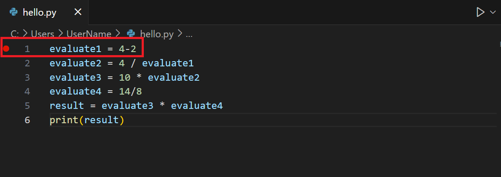
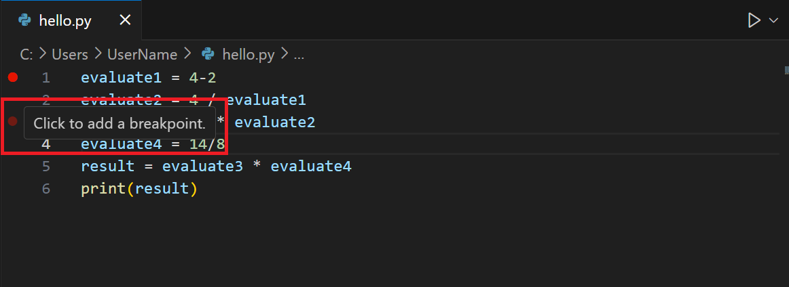
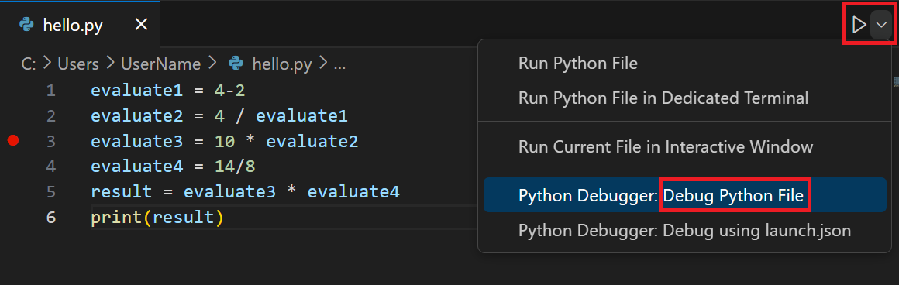
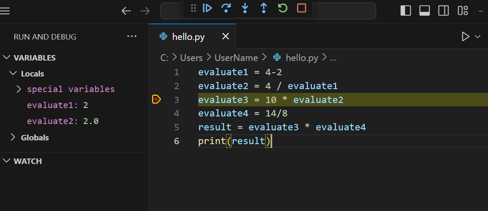
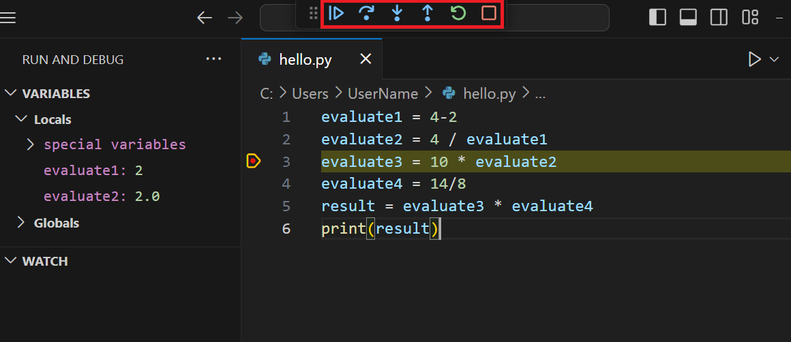
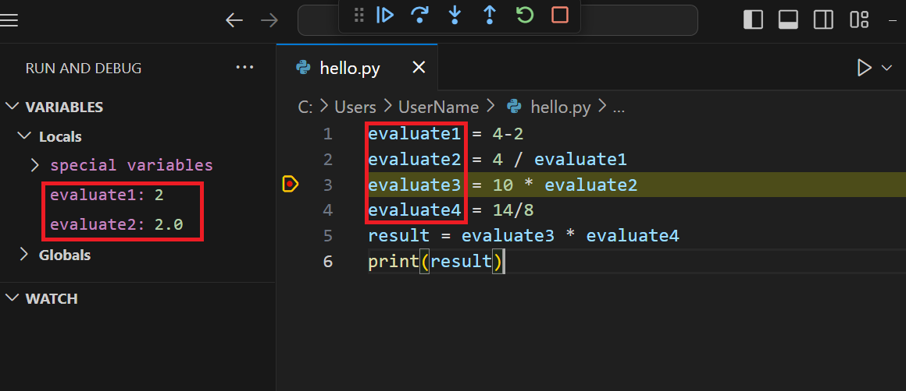
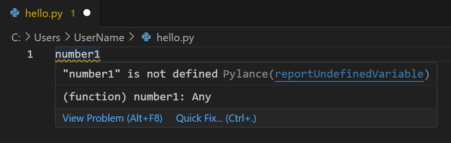
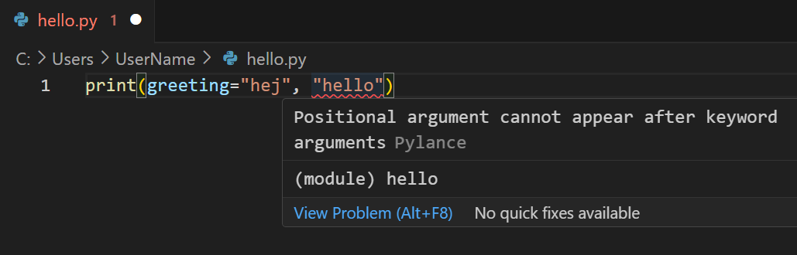

# Debuggingtekniker
Debugging är processen att hitta och åtgärda buggar (fel) i programvaran. Förståelsen av felsökning, eller debugging, är avgörande för varje programmerare och att kunna identifiera och korrigera fel (buggar) i din kod är en viktig färdighet och något som kommer att ligga till grund för en ökad förståelse av den kod du skriver. I det här avsnittet kommer vi att gå igenom grundläggande debuggingtekniker som hjälper dig att snabbt hitta och åtgärda fel i dina Python-program.

## Vad är en bugg?
En bugg är ett fel i programmet som orsakar att programmet resulterar i ett oväntat beteende (t.ex. som att fel resultat ges vid summering av två heltal eller dylikt) eller att applikationen till och med avbryts och kraschar. Buggar kan uppstå av många olika skäl, inklusive felaktig kodning, missförstånd av specifikationen, eller oförutsedda användarinteraktioner.

## Grundläggande felsökning
Ett av de enklaste sätten att debugga är att använda `print()`-funktionen för att visa värden på variabler eller för att bekräfta att exekveringen har nått en viss del av koden. Ponera exempelvis att vi vill undersöka resultatet på en matematisk operation enligt:
```python
sum_of_operations = (10 * 4 / (4-2)) * 14 / 8
print(sum_of_operations)
```
<div class="code-example" markdown="1">
<pre><code>35.0</code></pre>
</div>

Vi kan även bryta ned det i flera delar och undersöka varje uttryck var för sig:
```python
evaluate1 = 4-2
print(evaluate1)
evaluate2 = 4 / evaluate1
print(evaluate2)
evaluate3 = 10 * evaluate2
print(evaluate3)
evaluate4 = 14/8
print(evaluate4)
result = evaluate3 * evaluate4
print(result)
```
<div class="code-example" markdown="1">
<pre><code>2
2.0
20.0
1.75
35.0</code></pre>
</div>

## Inbyggd felsökning i Visual Studio Code
Ovan tillvägagångssätt kan dock snabbt bli förhållandevis tradigt och det finns därför andra sätt att felsöka på. Visual Studio Code har exempelvis en inbyggd felsökare (som ingår i tillägget Python när du installerar det) vilket låter dig stega igenom koden - rad för rad. Detta ger dig en djupare förståelse av hur ditt program fungerar samt vart och varför vissa problem uppstår.

Debugging-verktyget nyttjas enligt följande steg:
1. Placera en s.k. break-point (brytpunkt) på den kodrad som du vill påbörja felsökningen från.
{: .styled-image }
Brytpunkten läggs till genom att vänsterklicka där du ser den röda pricken i bilden och du tar bort brytpunkter genom att klicka på den på nytt. Det är även möjligt att lägga till flera brytpunkter, i de fall man t.ex. vill kunna hoppa från en brytpunkt till en annan istället för att stega igenom koden.
{: .styled-image }

2. Starta debugging, t.ex. genom att klicka på "Debug Python File", F5 eller "Start Debugging" från "Run"-menyn.
{: .styled-image }
Din kod kommer nu att exekveras fram till och med den brytpunkt du placerat och du kommer bemötas av ett nytt gränssnitt.
{: .styled-image }

3. Du har nu möjligheten att stega igenom koden via navigationsmenyn t.ex. genom att antingen hoppa till nästa brytpunkt, stega igenom varje rad var för sig eller avbryta felsökningen.
{: .styled-image }
Notera att du kan se värdet i dina variabler i fönstret till vänster såväl som genom att hovera över variabelns namn (så länge kodraden i fråga faktiskt har exekverats, d.v.s. att variabeln har tilldelats ett värde.)
{: .styled-image }

Detta är ett extremt värdefullt verktyg när man försöker identifiera eventuella fel eller oväntade resultat som har uppstått i koden. Exempelvis kan vi gå igenom varje iteration av en loop steg-för-steg för att identifiera varför ett specifikt felmeddelande dyker upp vid körning av koden. Du kan läsa mer om hur man använder verktyget här: [VS Code - Debugging](https://code.visualstudio.com/docs/python/debugging#_basic-debugging)

## Inbyggd hantering av syntaxfel
Visual Studio Code hjälper även till med att identifiera syntaxfel och andra problem i din kod med understrykningar och beskrivningar. Exempelvis får vi varningar om vi deklarerar en variabel utan att tilldela den ett värde:
{: .styled-image }

Vid faktiska fel (som medför att programmet dessutom inte är körbart) så får vi även information om vad felet beror på - vilket kan hjälpa oss att lösa problemet:
{: .styled-image }

# Sammanfattning
Att bemästra debuggingtekniker är avgörande för alla programmerare. Genom att använda Visual Studio Codes inbyggda verktyg och Python-specifika metoder som `print()`, kan du effektivt identifiera och åtgärda problem i dina program. Denna kunskap, tillsammans med en solid förståelse för felhantering, lägger grunden för att skriva robust och pålitlig kod.