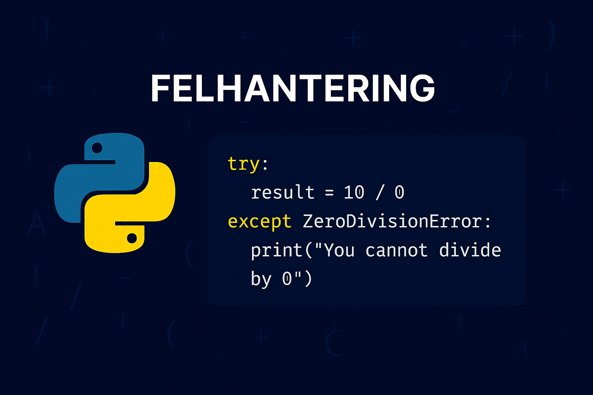

# Felhantering
Att hantera fel och undantag är en central del av att skriva robusta program. I Python används `try` och `except`-block för att fånga och hantera fel som kan uppstå under programmets körning. Detta gör att programmet kan fortsätta att köra eller ge användaren en förståelig felmeddelande istället för att krascha.

{: .styled-image }

## Grundläggande felhantering
Felhantering i Python börjar med ett `try`-block som innehåller den kod som kan orsaka ett fel. Ett `except`-block följer sedan, som definierar hur programmet ska svara om ett fel uppstår i `try`-blocket.
```python
try:
    number = int(input("Enter a number: "))
    print(f"You entered {number}.")
except ValueError:
    print("ERROR: Input needs to be numerical!")
```

I exemplet ovan försöker programmet att konvertera användarens inmatning till ett heltal. Om användaren anger något som inte kan konverteras till ett heltal, kastas ett `ValueError`, som fångas av `except`-blocket.

### Specifika undantag
Python tillåter dig att fånga specifika typer av fel, vilket ger dig möjlighet att hantera olika fel på olika sätt.
```python
try:
    with open("does_not_exist.txt", "r") as file:
        content = file.read()
except FileNotFoundError:
    print("ERROR: File was not found!")
```
I det här exemplet försöker programmet öppna en fil som inte finns. Python kastar då ett `FileNotFoundError`, som hanteras av `except`-blocket.

### Flera except-block
Du kan ha flera `except`-block för att hantera olika typer av undantag. Detta är användbart när en del av din kod kan kasta mer än en typ av undantag, och du vill hantera dem på olika sätt.
```python
try:
    numerator = int(input("Enter a numerator: "))
    denominator = int(input("Enter a denominator: "))
    result = numerator / denominator
except ValueError:
    print("ERROR: Both values must be numerical!")
except ZeroDivisionError:
    print("ERROR: The denominator cannot be 0!")
```

### Finally-block
Ett `finally`-block kan läggas till efter `except`-blocken. Koden i `finally`-blocket körs alltid, oavsett om ett undantag uppstod eller inte. Detta är användbart för att städa upp resurser, som att stänga filer eller nätverksanslutningar.
```python
try:
    file = open("example.txt", "r")
    # Your code, working with the opened file goes here
except FileNotFoundError:
    print("ERROR: File not found!")
    file = None
finally:
    if file is not None:
        file.close()
        print("File closed.")
```

### "Kasta" exceptions (raising exceptions)
Ibland kan det vara lämpligt att medvetet "kasta" ett undantag i din kod, vilket kan göras med `raise`-satsen. Detta är användbart när du till exempel vill tvinga fram en kontroll av indata.
```python
age = int(input("Enter your age: "))
if age < 0:
    raise ValueError("Age cannot be a negative number.")
```

## Sammanfattning
Genom att effektivt använda Pythons felhantering kan du bygga mer pålitliga och användarvänliga program. Det är en god praxis att förutse potentiella fel och skriva kod som hanterar dessa situationer, vilket leder till en bättre användarupplevelse och underlättar felsökning och underhåll av programmet.