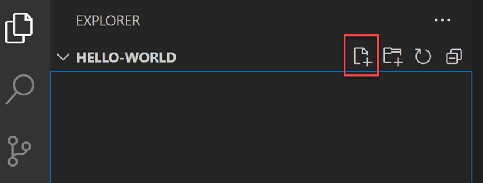
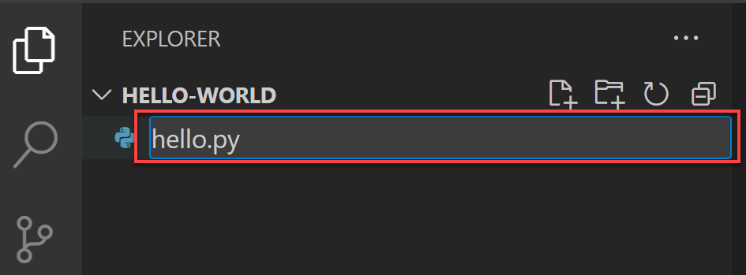
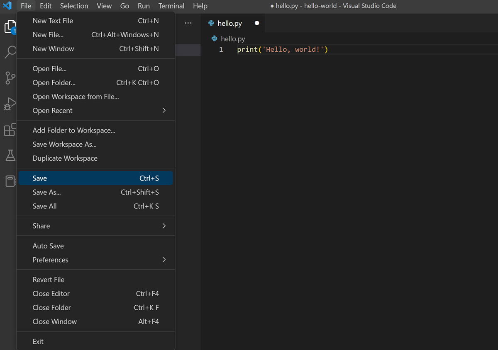
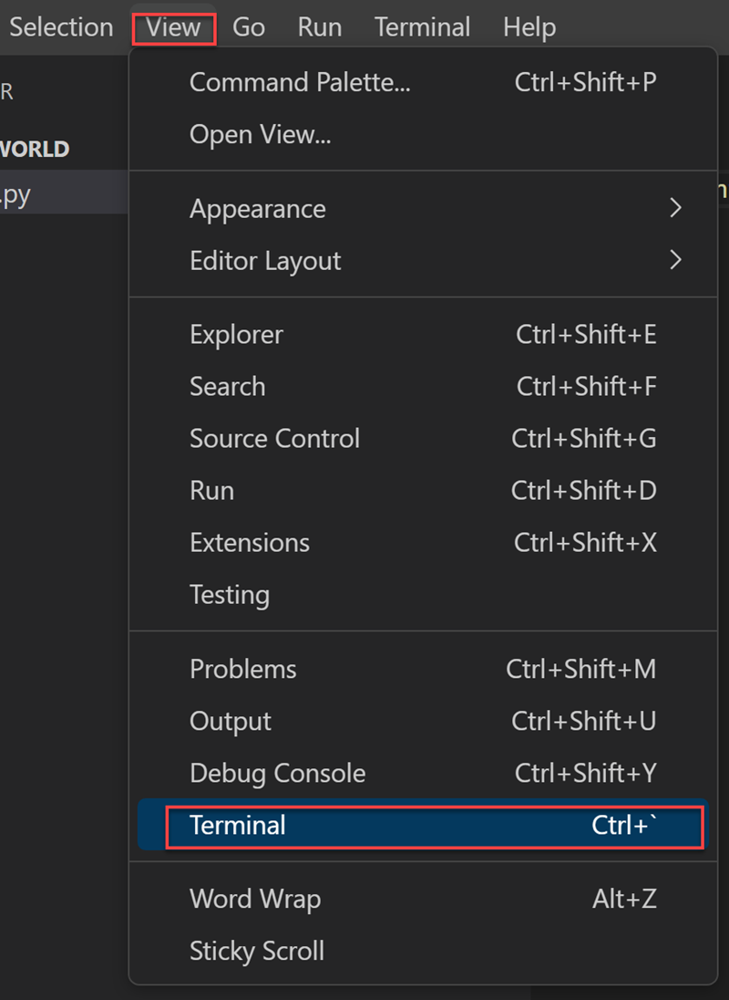
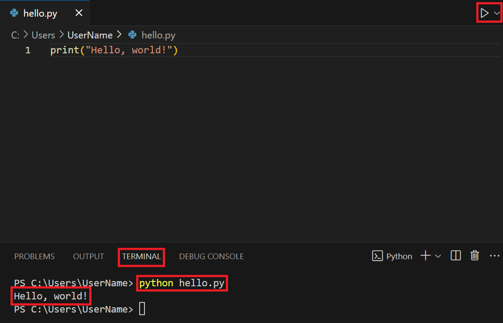
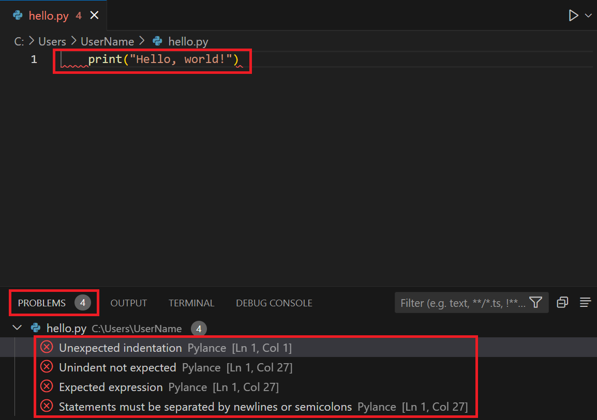

# Skriv din första Python-applikation

Med Python och Python-verktyg installerade kan du nu skapa din första Python-applikation! Vi gör detta genom att skapa en tom mapp, öppna mappen i Visual Studio Code (eller den utvecklingsmiljö du valt) och skapar sedan ditt första program.

## Steg 1 - Skapa en ny projektmapp

Många projekt börjar med en tom mapp, vilket är hur du kommer att starta din.

1. Öppna ett nytt terminalfönster i Visual Studio Code genom att välja Terminal -> Ny terminal.
2. Skapa en tom mapp som heter _"hello-world"_, navigera in till mappen och öppna VS Code från den mappen genom att ange följande kommandon:
3. Skapa en ny mapp som heter hello-world:\
  `mkdir hello-world`
4. Navigera till hello-world-mappen:\
  `cd hello-world`  
5. Öppna Visual Studio Code från den mappen:\
  `code .`

Alternativt så kan du nyttja alternativet File -> Open Folder från gränssnittet i VSCode, efter att du skapat mappen (vilket du även kan uppnå genom att exempelvis högerklicka och välja "Skapa ny mapp" på Skrivbordet på din dator).

## Steg 2 - Starta VS Code med projektmappen

Med Visual Studio Code öppet från din tomma mapp skapar du nu en Python-fil för att visa meddelandet: Hello world.

* Inuti Explorer-vyn, där du ser den tomma mappens namn (_hello-world_), välj alternativet "Ny fil".

{: .styled-image }

* Namnge den nya filen _hello.py_ genom att ange det i textrutan och tryck på Enter.

{: .styled-image }

Genom att använda filtillägget _.py_ berättar du för VS Code att det ska tolka den här filen som ett Python-program, så att den utvärderar innehållet med Python-tillägget.

* Ange följande Python-kod i redigeringspanelen. Detta kommando använder utskriftsfunktionen för att visa texten `Hello, world!` när din applikation körs.
`print('Hello, World!')`

* Spara filen genom att välja File och Save (eller Ctrl+S/⌘ + S).

{: .styled-image }

{: .highlight }
Det är viktigt att alltid spara ändringar i sin kod innan man kör koden. Du kan identifiera huruvida du har osparade ändringar i en fil genom den vita prick som som blir synlig när ändringar sker i fil-fliken (se bilden ovan).

## Steg 3 - Kör ditt första program

Du kan nu köra din applikation inifrån VS Code. Du gör detta genom att öppna den inbyggda terminalen i VS Code (View -> Terminal).

{: .styled-image }

I terminalfönstret så skriver du sedan följande kommando, följt av enter, för att köra Python-koden:
`python hello.py`

Vilket, för denna applikation, ger oss följande resultat:

{: .styled-image }

Du har nu skapat din första Python-applikation och kört applikationen för att generera en output! För att förstå hur vi kan skriva mer avancera applikationer, exempelvis ett mindre spel, så behöver vi först förstå de olika beståndsdelarna som vi kan arbeta med i Python.

## Felsökning
Felsökning är en kritisk färdighet inom programmering som hjälper dig att identifiera och korrigera fel i din kod, vilket vi kommer att diskutera även i framtida kapitel. Det kan dock redan nu vara relevant att ta följande punkter i beaktande när du stöter på felmeddelanden:

* Läs felmeddelandet noggrant: Python ger ofta specifika ledtrådar om vad och var felet ligger. Linjenumret och typen av fel kan peka dig i rätt riktning.

* Kontrollera syntaxen: Ett vanligt misstag är att glömma tecken som kolon (`:`), parenteser (`()`, `[]`, `{}`) eller att använda felaktig indentering, vilket är avgörande i Python. Exempelvis kommer vi att stöta på ett syntaxfel om vi modifierar vårt program genom att lägga till extra indentering:
```python
      print("Hello, world!")
```
Vilket resulterar i följande fel:
{: .styled-image }

Som vi kan se i bilden så indikerar VSCode vart felet uppstår (där `Ln 1` t.ex. indikerar rad 1), vilket fel som har uppstått (t.ex. `Unexpected indentation`) och felet/felen tydliggörs dessutom direkt i koden. Detta är inte fallet för alla typer av fel, vilket kommer att diskuteras i framtida kapitel, men vanliga syntaxfel kommer att uppmärksammas redan innan du tillåts köra koden.

* Sök efter lösningar: Om du inte kan lösa problemet på egen hand, använd sökmotorer för att hitta andra som kanske har stött på och löst liknande problem. Stack Overflow är exempelvis en mycket värdefull resurs i detta syfte.

# Utforska dokumentationen
Python-dokumentationen är en omfattande resurs som innehåller information om Pythons syntax, standardbibliotek och mer:

* Officiella dokumentationen: 
Börja med [Pythons officiella dokumentation](https://docs.python.org/3/). Den är välstrukturerad och innehåller tutorials, modulindex och sökfunktioner för att snabbt hitta det du behöver.

* Modulindex: 
Utforska de [inbyggda modulerna](https://docs.python.org/3/py-modindex.html) för att se vilka funktioner och klasser som finns tillgängliga. Detta kan bredda din förståelse för vad som är möjligt med Python och hur du kan utöka funktionaliteten i dina program.

* [FAQ](https://docs.python.org/3/faq/general.html) och [The Python Tutorial](https://docs.python.org/3/tutorial/index.html#tutorial-index): 
Dessa sidor kan vara särskilt användbara för att få praktiska tips och svar på vanliga frågor.

# Sammanfattning
Att skapa din första Python-applikation är ett spännande första steg in i programmeringsvärlden. Genom att följa stegen för att konfigurera din utvecklingsmiljö, skriva och köra ditt första skript, har du lagt grunden för din programmeringsresa. Kom ihåg att praktik är nyckeln till framgång; fortsätt experimentera med din kod, utforska nya funktioner och bygga på din förståelse för Python. Som med alla färdigheter, utvecklas din programmeringsförmåga med tiden och praktiken, så var tålmodig och fortsätt att utforska och lära dig.