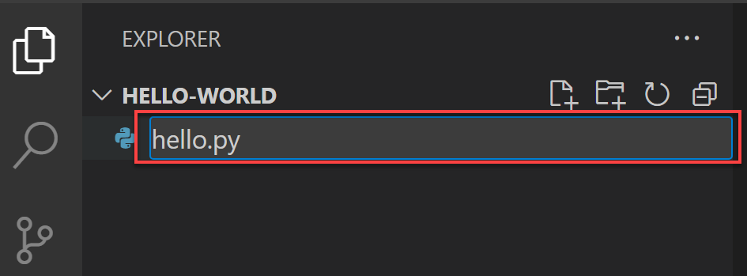
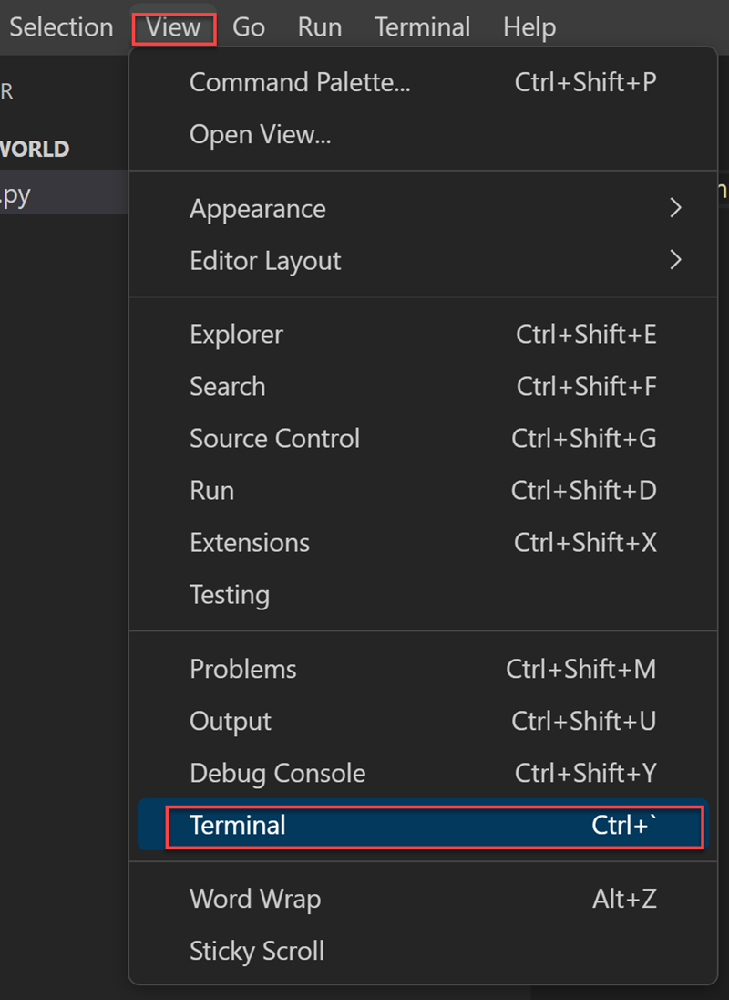

# Skriv din första Python-applikation

Med Python och Python-verktyg installerade kan du nu skapa din första Python-applikation! Vi gör detta genom att skapa en tom mapp, öppna mappen i Visual Studio Code (eller den utvecklingsmiljö du valt) och skapar sedan ditt första program.

## Steg 1 - Skapa en ny projektmapp

Många projekt börjar med en tom mapp, vilket är hur du kommer att starta din.

1. Öppna ett nytt terminalfönster i Visual Studio Code genom att välja Terminal -> Ny terminal.
2. Skapa en tom mapp som heter "hello-world", navigera in till mappen och öppna VS Code från den mappen genom att ange följande kommandon:
3. Skapa en ny mapp som heter hello-world:\
  `mkdir hello-world`
4. Navigera till hello-world-mappen:\
  `cd hello-world`  
5. Öppna Visual Studio Code från den mappen:\
  `code .`

Alternativt så kan du nyttja alternativet File -> Open Folder från gränssnittet i VSCode, efter att du skapat mappen (vilket du även kan uppnå genom att exempelvis högerklicka och välja "Skapa ny mapp" på Skrivbordet på din dator).

## Steg 2 - Starta VS Code med projektmappen

Med Visual Studio Code öppet från din tomma mapp skapar du nu en Python-fil för att visa meddelandet: Hello world.

* Inuti Explorer-vyn, där du ser den tomma mappens namn (hello-world), välj alternativet "Ny fil" (se Figur 1).

{: .styled-image }

* Namnge den nya filen hello.py genom att ange det i textrutan och tryck på Enter (se Figur 2).

{: .styled-image }

Genom att använda filtillägget .py berättar du för VS Code att det ska tolka den här filen som ett Python-program, så att den utvärderar innehållet med Python-tillägget.

* Ange följande Python-kod i redigeringspanelen. Detta kommando använder utskriftsfunktionen för att visa texten `Hello, world!` när din applikation körs.
`print('Hello, World!')`

* Spara filen genom att välja File och Save (eller Ctrl+S/⌘ + S).

{: .styled-image }

{: .highlight }
**OBS!** Det är viktigt att alltid spara ändringar i sin kod innan man kör koden. Du kan identifiera huruvida du har osparade ändringar i en fil genom den vita prick som som blir synlig när ändringar sker i fil-fliken.

## Steg 3 - Kör ditt första program

Du kan nu köra din applikation inifrån VS Code. Du gör detta genom att öppna den inbyggda terminalen i VS Code (View -> Terminal).

{: .styled-image }

I terminalfönstret så skriver du sedan följande kommando, följt av enter, för att köra Python-koden:
python3 hello.py

Vilket, för denna applikation, ger oss följande resultat:

{: .styled-image }

Du har nu skapat din första Python-applikation och kört applikationen för att generera en output! För att förstå hur vi kan skriva mer avancera applikationer, exempelvis ett mindre spel, så behöver vi först förstå de olika beståndsdelarna som vi kan arbeta med i Python.
