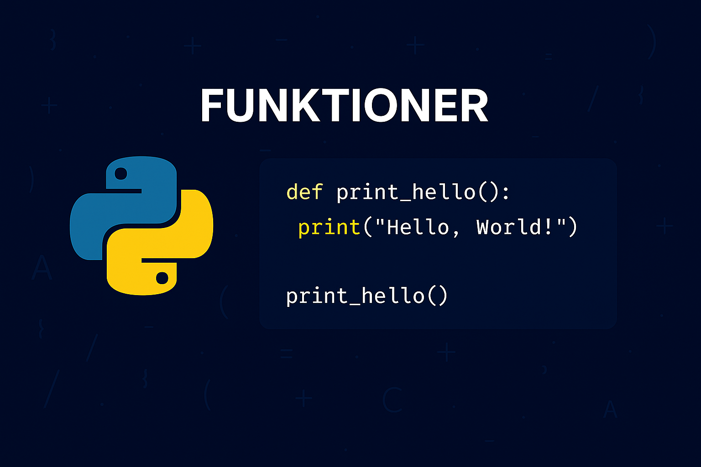

# Funktioner
Python kommer med en rik uppsättning inbyggda funktioner som är redo att användas i dina program. Dessa funktioner utför "vanliga uppgifter" och gör det enklare att skriva kod. Till exempel:

* `print()` som används för att visa information till användaren.
* `input()` som tar emot indata från användaren.
* `len()` som ger längden på en kollektion, t.ex. en lista eller en sträng.
* `range()` som genererar en sekvens av nummer, vilket är användbart i loopar.

Att använda inbyggda funktioner är enkelt. Du behöver bara ange funktionens namn och ge den rätt argument (den information som funktionen behöver för att utföra sin uppgift) för att anropa den. Exempelvis kan du, som du vet, skriva ut något i terminalen enligt:
```python
print("Hello world!")
```
<div class="code-example" markdown="1">
<pre><code>Hello world!</code> </pre>
</div>

Utan att själv behöva skriva implementationen av kod som faktiskt ser till så att texten skrivs ut i terminalen. Det kan dock tänkas vara så att det finns fall där det inte finns någon inbyggd funktion som kan utföra den funktion vi behöver för just vår applikation. Exempelvis en enkel funktion som adderar två heltal för en miniräknar-applikation. I dessa fall behöver vi själva deklarera och implementera funktionen.

{: .styled-image }

## Skapa egna funktioner
Medan inbyggda funktioner täcker många vanliga behov, kommer du ofta att stöta på situationer där du behöver utföra uppgifter som är specifika för ditt program. Genom att då definiera egna funktioner kan du skapa återanvändbara kodblock som utför specifika uppgifter.

### Syntax för funktioner
För att definiera en funktion i Python använder du nyckelordet `def`, följt av ett namn på funktionen, parenteser () som kan innehålla parametrar (input-värden funktionen tar emot för att utföra sina uppgifter), och slutligen ett kolon (`:`). Kodblocket som utgör funktionens kropp indenteras under funktionsdeklarationen, likt hur koden som utförs i en loop indenteras under loop-deklarationen.

Låt oss exempelvis skapa en funktion som hälsar en användare med namn:
```python
def say_hello(name):
    print(f"Hi {name}, welcome back!")
```

### Funktionsanrop
Denna kod kommer inte att resultera i någon utskrift då vi enbart har deklarerat och implementerat funktionen utan att faktiskt _anropa_ den. För att göra ett anrop till funktionen så uppnås det på samma vis som när du anropat inbyggda funktioner, t.ex. enligt:
```python
def say_hello(name):
    print(f"Hi {name}, welcome back!")

say_hello("Anton")
```
<div class="code-example" markdown="1">
<pre><code>Hi Anton, welcome back!</code> </pre>
</div>

### Återanvändningsbar kod
En funktion som sådan representerar _återanvändningsbar kod_, d.v.s. att vi kan anropa funktionen vid behov för att utföra dess funktion, t.ex. enligt:
```python
def say_hello(name):
    print(f"Hi {name}, welcome back!")

say_hello("Anton")

for x in range(0,3):
    print(x)

say_hello("Max")
```
<div class="code-example" markdown="1">
<pre><code>Hi Anton, welcome back!
0
1
2
Hi Max, welcome back!</code> </pre>
</div>

Detta är enormt fördelaktigt om vi vet att vi kommer vilja utföra samma funktion flera gånger i vår applikation. Exempelvis kan vi istället för att skriva en separat loop för varje utskrift av elementen i en sträng definiera detta som en funktion och anropa den vid behov. Vi behöver m.a.o. bara skriva en enda loop för att kunna hantera utskriften för elementen i ___alla strängar___.
```python
def print_chars_in_string(input):
    for c in input:
        print(c)

print_chars_in_string("Hello")
print_chars_in_string("world!")
```
<div class="code-example" markdown="1">
<pre><code>H
e
l
l
o
w
o
r
l
d
!</code> </pre>
</div>

## Returvärden
Funktioner kan ta emot data genom parametrar och kan också returnera data till den del av koden som anropade funktionen. Returvärden specificeras med `return`-nyckelordet.

Ponera att vi vill ha en funktion som tar emot två heltal och returnerar summan av dessa heltal, vi kan då skriva något i stil med:
```python
def add(number1, number2):
    sum_numbers = number1 + number2
    return sum_numbers

added_numbers = add(5, 10)
print(added_numbers)
added_numbers = add(3, 6)
print(added_numbers)
```
<div class="code-example" markdown="1">
<pre><code>15
9</code> </pre>
</div>

Det är även möjligt att definiera funktioner utan returvärden. Detta kan tänkas vara relevant om vi exempelvis enbart vill att funktionen ska utmynna i utskrifter. Ponera exempelvis att vi direkt vill skriva ut summan av heltalen i funktionen `add` istället för att hämta dem så uppnås detta enligt:
```python
def add(number1, number2):
    sum_numbers = number1 + number2
    print(sum_numbers)

added_numbers = add(5, 10)
print(added_numbers)
added_numbers = add(3, 6)
```
<div class="code-example" markdown="1">
<pre><code>15
None
9</code> </pre>
</div>

Huruvida vi nyttjar nyckelordet `return` beror således på _syftet_ bakom funktionen vi implementerar. Vill vi kunna arbeta med värden som en funktion genererar så måste dessa returneras. Om vi inte har detta behov så använder vi inte nyckelordet `return`.

{: .highlight}
I det fall vi försöker hämta ut värden från en funktion som inte returnerar några värden så kommer vi alltid att ges värdet `None`. Detta är viktigt att komma ta i beaktande vid bl.a. felsökning.

## Multipla returnvärden
Funktioner kan returnera olika typer av värden, t.ex. baserat på etablerade villkor eller logik inuti funktionens implementation. Exempelvis kan vi utföra och skicka tillbaka olika area-beräkningar baserat på vilken typ av geometrisk form som angivits som input till funktionen enligt:
```python
def calculate_area(shape, base, height):
    if shape == "triangle":
        return 0.5 * base * height
    elif shape == "rectangle":
        return base * height
    else:
        return None

print(calculate_area("triangle", 5, 10))
print(calculate_area("rectangle", 5, 10))
```
<div class="code-example" markdown="1">
<pre><code>25
50</code> </pre>
</div>

Det är dessutom möjligt att skicka tillbaka flera värden samtidigt, lagrat som en `tuple`. Exempelvis enligt:
```python
def calculate_statistics(numbers):
    mean = sum(numbers) / len(numbers)
    minimum = min(numbers)
    maximum = max(numbers)
    return mean, minimum, maximum

avg, min_val, max_val = calculate_statistics([10, 20, 30, 40, 50])
print(type(calculate_statistics([10, 20, 30, 40, 50])))
print(f"Mean: {avg}, Min: {min_val}, Max: {max_val}")
```
<div class="code-example" markdown="1">
<pre><code>< class 'tuple' >
Mean: 30.0, Min: 10, Max: 50</code> </pre>
</div>

{: .highlight }
Ordningen på variablerna spelar, som alltid, roll vid denna typ av tilldelning. Skulle vi exempelvis revidera anropet enligt: `min_val, avg, max_val = calculate_statistics([10, 20, 30, 40, 50])` så skulle vi få resultatet: `Mean: 10, Min: 30.0, Max: 50`.

# Sammanfattning
Funktioner i Python ger en robust grund för att strukturera och återanvända kod. Genom att bemästra funktioner, från de grundläggande koncepten såsom funktionsparametrar och funktionsanrop till avancerade funktioner såsom lambda och rekursiva funktioner, kan du skriva effektiv och lättläst kod. Det är värt att notera att väl designade funktioner kan förenkla komplexa uppgifter och bidra till bättre kodunderhåll och flexibilitet.