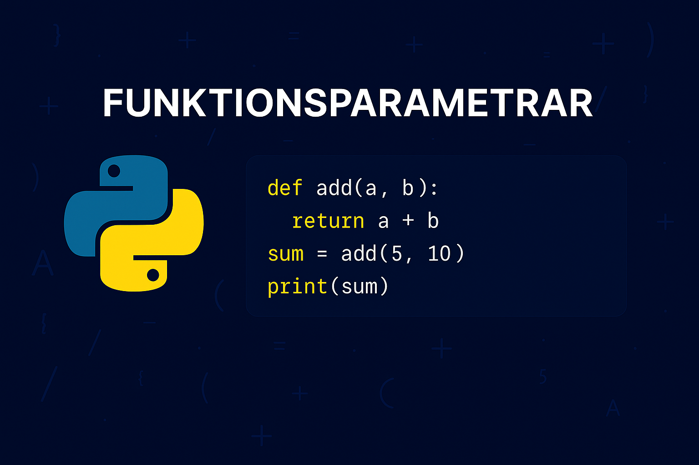

# Parametrar
Parametrar är de variabler som definieras av en funktion, som den förväntas ta emot när den anropas. De är del av funktionens deklaration och fungerar som "platshållare" för de värden som funktionen ska bearbeta. Parametrar anger vilken typ av data en funktion förväntar sig och hur många dataelement den kan ta emot.

Till exempel, i funktionen `def add(a, b):`, är `a` och `b` _parametrar_ för funktionen `add`. De indikerar att funktionen `add` __förväntar__ sig två inputs när den _anropas_.

{: .styled-image }

## Argument vs parameter
Argument är de faktiska värdena eller uttrycken som skickas till funktionen vid funktionsanrop. Dessa värden "fyller i" funktionens parametrar och används sedan inuti funktionen för dess beräkningar eller operationer.

När du kör `resultat = add(5, 3)`, är `5` och `3` _argument_ som skickas till funktionen `add`. De ersätter _parametrarna_ `a` och `b` när funktionen utför sin operation, vilket i detta fall är att addera talen `5` och `3`.

Om vi exempelvis föreställer oss att vi har en funktion som jämför två tal och returnerar det största talet enligt:
```python
def find_max(number1, number2): # number1 and number2 are parameters
    if number1 > number2:
        return number1
    else:
        return number2

find_max(10,5)                  # 10 and 5 are arguments
```

{: .highlight }
Parametrar är definierade i _funktionens deklaration_ och används inuti funktionen som variabler. Argument är istället de faktiska värdena som skickas till funktionen vid _anrop_. Ett argument matchar mot en parameter baserat på dess position när funktionen anropas.

## Matchning av parametrar i anrop och deklaration
Argument i <u>anropet</u> måste __matcha__ parametrarna i <u>funktionsdeklarationen</u>. D.v.s. att det inte vore möjligt att enbart ange en enda parameter i ett funktionsanrop. Nedan exempel genererar därför ett felmeddelande vid körning.
```python
def add(number1, number2):
    sum_numbers = number1 + number2
    return sum_numbers

added_numbers = add(5)
```
<div class="code-example" markdown="1">
<pre><code>TypeError: add() missing 1 required positional argument: 'number2'</code> </pre>
</div>

Det skulle heller inte vara möjligt att ange en parameter för mycket enligt:
```python
def add(number1, number2):
    sum_numbers = number1 + number2
    return sum_numbers

added_numbers = add(5, 10, 15)
```
<div class="code-example" markdown="1">
<pre><code>TypeError: add() takes 2 positional arguments but 3 were given</code> </pre>
</div>

Antalet parametrar måste således matcha i anropet och deklarationen.

{: .highlight }
Variabelnamnen för parametrarna i en funktionsdeklaration är godtyckliga, d.v.s. att de exempelvis inte måste heta `number1` och `number2` i ovan exempel. Notera gärna även att vi i anropet anger faktiska värden. Detta innefattar att när funktionen tar emot parametrarna så kommer den att - i detta fall - ge variabeln `number1` värdet 5, variabeln `number2` värdet 10, osv. Ordningen som vi anger parametrarna i anropet är således viktig!

## Standardvärden för parametrar
Att definiera funktioner med standardvärden för vissa parametrar ökar flexibiliteten och användbarheten av funktionen. Det gör det möjligt att anropa funktionen med färre argument än vad som definierats, vilket kan förenkla kodanropen och göra koden mer lättläst.
```python
def say_hello(name, greeting="Hello"):
    print(f"{greeting}, {name} - welcome back!")

say_hello("Anna")  
say_hello("Erik", "Hi")
```
<div class="code-example" markdown="1">
<pre><code>Hello, Anna - welcome back!
Hi, Erik - welcome back!</code> </pre>
</div>

{: .highlight }
Parametrar med standardvärden (default parameters) måste placeras _efter_ parametrar utan standardvärden i funktionsdefinitionen. `def say_hello(greeting="Hello", name):` skulle med andra ord generera ett syntax fel.

## Obegränsat antal parametrar
Python tillåter dig att definiera funktioner som kan ta emot ett obegränsat antal positionella parametrar (`*args`) samt ett obegränsat antal namngivna, eller nyckelordsspecifika, parametrar (`**kwargs`). Detta gör funktionerna extremt flexibla och anpassningsbara till olika användningsfall.

### Positionella argument (`*args`)
Användningen av `*args` i en funktionsdefinition möjliggör mottagandet av en variabel lista av _positionella argument_ som en tuple. Detta är användbart när du inte vet i förväg hur många argument som kommer att skickas till funktionen.

```python
def add_all(*numbers):      
    total = 0
    for t in numbers:
        total += t
    return total

print(add_all(5, 10, 15, 20))   # numbers will contain 5, 10, 15, 20
print(add_all(5, 10))           # numbers will contain 5, 10
```
<div class="code-example" markdown="1">
<pre><code>50
15</code> </pre>
</div>

### Nyckelordsspecifika argument (`**kwargs`)
Användningen av `**kwargs` gör det möjligt för en funktion att acceptera ett obegränsat antal nyckelordsspecifika parametrar som en dictionary. Detta är användbart när du behöver hantera funktioner som kräver konfigurationsalternativ eller när du inte vet vilka nyckelord som kommer att användas.

```python
def user_profile(**kwargs):
    for key, value in kwargs.items():
        print(f"{key}: {value}")

user_profile(name="Anna", age=30, profession="Engineer")
user_profile(name="Erik", age=22)
```
<div class="code-example" markdown="1">
<pre><code>name: Anna
age: 30
profession: Engineer
name: Erik
age: 22</code> </pre>
</div>

### Kombinera `*args` och `**kwargs`
Du kan även kombinera `*args` och `**kwargs` i samma funktion för att tillåta en funktion att acceptera både en variabel lista av positionella argument och en variabel lista av nyckelordsspecifika argument.

```python
def combo_function(*args, **kwargs):
    total = sum(args)
    print(f"Sum of positional arguments: {total}")
    for key, value in kwargs.items():
        print(f"{key}: {value}")

combo_function(10, 20, name="Erik", profession="Developer")
```
<div class="code-example" markdown="1">
<pre><code>Sum of positional arguments: 30
name: Erik
profession: Developer</code> </pre>
</div>

# Sammanfattning
Att effektivt använda parametrar och returvärden i funktioner är avgörande för att skriva flexibel och återanvändbar kod. Förståelsen av standardvärden, variabla argument (`*args` och `**kwargs`), och typkonvertering direkt i parametrar kan utöka möjligheterna i hur du designar dina funktioner. Att förstå skillnaden mellan argument och parametrar, samt att kunna hantera olika returtyper, är nyckeln till att bygga robusta funktioner som kan hantera en mängd olika input och situationer.