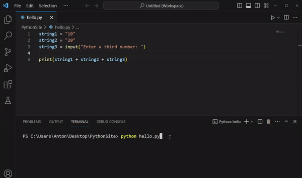

# Input och output i Python 
Vi har hittills arbetat med olika variabeltyper och operatorer där vi använt oss av funktionen `print()` för att generera en _output_, d.v.s. ett utfall av den kompilerade koden som en användare kan se. Det kan dock tänkas vara relevant att tillåta en användare att skicka in värden som programmet sedan kan använda sig utav, s.k. _inputs_.

Det kan exempelvis vara ett namn, en ålder eller dylik information som programmet behöver veta för att fungera som tänkt. Exempelvis har du säkerligen någon gång angett information i en dialogruta eller ett formulär, t.ex. ditt användarnamn och lösenord när du loggar in via Studium. Denna information måste datorn kunna spara, tolka och eventuellt nyttja och Python har därför förprogrammerade funktioner för att på ett enkelt sätt hantera inputs.

För att skicka in värden till våra program i Python så kan vi nyttja funktionen `input()`.

## Hur gör man inputs i Python?
Med funktionen `input()` kan man enkelt mata in värden till programmet. Funktionen fungerar på så vis att när programmet når kodraden som berör `input()`-funktionen så kommer programmet att vänta till dess att användaren anger någon input i terminalen, kommer programmet vänta tills dess att användaren har skrivit in något i konsolen och sedan fortsätta i programmet.

### Syntax för input
Du kan använda funktionen `input()` med följande syntax:
```python
userInput = input()
```
Där variabeln `userInput` kommer att lagra värdet som har angivits. Det är även möjligt att tillhandahålla instruktioner till användaren innanför parenteserna, t.ex. avseende vilken information man vill ha från användaren. T.ex. enligt:
```python
# Exempel 1
string1 = "10"
string2 = "20"
string3 = input("Enter a numerical value: ")
print(string1 + string2 + string3)
```
Där vi kommer att få utskriften `"1020"` + det värde som användaren anger, vare sig det faktiskt är ett numeriskt värde eller ej.

Observera att det är ett mellanslag i uppmaningen `"Enter a numerical value: "`. Detta är för att få ett mellanrum mellan uppmaningen och värdet som anges, vilket gör programmet lite mer stilrent. Vi kan i detta fall även se hur programmet stannar upp och väntar på input från användaren innan programmet fortsätter:



Som du kan se i GIF:en så kommer utskriften att bli `"102030"` (om `30` anges som input), vilket kan tänkas vara en svårtolkad input. Avser vi exempelvis ett enda värde, en talföljd eller tre individuella värden? Det kan därför vara fördelaktigt att _formatera_ vår utskrift.

### Formatera utskrifter i Python
Du kan formatera dina utskrifter så att de presenteras såsom du vill, exempelvis genom att separera variablvärden med kommatecken, mellanslag eller presentera informationen över flera rader.

##### Flera utskrifter samtidigt
Ponera att vi enbart vill skriva ut string1 resp. string2 från Exempel 1, fast som två separata värden:
```python
# Exempel 2
string1 = "10"
string2 = "20"
print(string1, string2) # Will print: 10 20
```
Kommatecknet används med andra ord för att separera de två variablerna med ett mellanslag.

#### Utskrifter på flera rader
Vi kan även skriva ut värdena på olika rader genom att nyttja `\n` för att representera en radbrytning:
```python
# Exempel 3
print("Hello,", "\nworld!")
```

### Typkonvertering
Det är även viktigt att ta i beaktande att all input som ges av input() kommer att vara av datatypen string. D.v.s. att oavsett om användaren anger `30`, `true`, `2.3` så kommer det att lagras som `"30"`, `"true"` resp. `"2.3"`.

Detta är viktigt att ta i beaktande då vi snabbt kan stöta på felmeddelanden om vi exempelvis försöker utföra en matematisk operation på ett inputvärde:
```python
# Exempel 1
number1 = 10
number2 = 20
number3 = input("Enter a numerical value: ")
print(number1 + number2 + number3) # Will result in the following error: TypeError: unsupported operand type(s) for +: 'int' and 'str'
```
Om vi ponerar att användaren har angivit `30` i terminalen så kommer detta - som tidigare nämnt - ha lagrats som `"30"`. När vi sedan försöker utföra addition för att summera våra numeriska värden så får vi i praktiken något i stil med: `10 + 20 + "30"`, vilket resulterar i ett felmeddelande då enbart numeriska värden kan summeras.

För att hantera sådana problem så behöver vi _konvertera_ vårt inputvärde från `string` till `int`.

I Python använder man typkonvertering för att konvertera (casta) en datatyp till en annan. Det är exempelvis vanligt att konvertera en `string` till en `int` eller vise versa. Detta kan göras med inbyggda funktioner såsom `int()`, `str()` eller `float()`.

#### Python är ett starkt och dynamiskt typat programmeringsspråk
Python är ett _starkt typat språk_ (strongly typed language) vilket innebär att det spelar roll vilken datatyp en variabel innehåller. Det är exempelvis skillnad på strängen `"1"` och siffran `1`. Som vi såg i föregående exempel så skulle vi därför stöta på problem om vi exempelvis försöker utföra en matematisk operation på textuella värden.

Python är även ett _dynamiskt typat språk_ (dynamically typed language) vilket innebär att du inte specificerar datatypen för de variabler du skapar. Exempelvis kan vi lagra ett textvärde i variabeln number1, trots att namnet indikerar att det är ett heltal. 

Fördelen med detta är att koden blir något mer abstrakt, lättare att förstå och argumenterbart enklare att skriva - med nackdelen att du själv behöver ha kontroll på vad för slags datatyp en variabel innehåller.

#### Konvertera (casta) en datatyp
Problemet med olika datatyper löser man genom att casta (konvertera) en datatyp till en annan. Python har inbyggda funktioner som gör att man direkt konverterar en datatyp till en annan. Några av de vanligaste funktionerna för att konvertera datatyper är:

* `int()`
* `str()`
* `float()`
* `bool()`

Om vi exempelvis skulle vilja konvertera inputvärdet från vårt tidigare exempel till ett numeriskt värde så kan vi uppnå detta på följande vis:
```python
number1 = 10
number2 = 20
number3 = input("Enter a numerical value: ")
print(number1 + number2 + int(number3))
```

Motsvarande operationer går att göra med `str()` som konverterar en variabel till en `string`, eller `float()` som konverterar en variabel till en `float`, osv.

#### Ha koll på vad du försöker konvertera!
Notera dock att alla konverteringar inte kommer att lyckas. Exempelvis kommer vi inte kunna konverta `"11.3"` till ett heltal enligt:
```python
number1 = "11.3"
int(number1) 
```
Då `11.3` inte är ett heltal snarare ett decimaltal (d.v.s. en `float` istället för en `int`).

Det är således viktigt att hålla koll på vilken datatyp variabeln representerar när man vill utföra konvertering.
