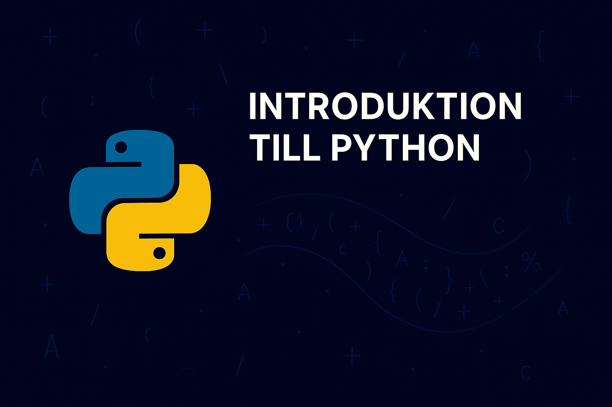
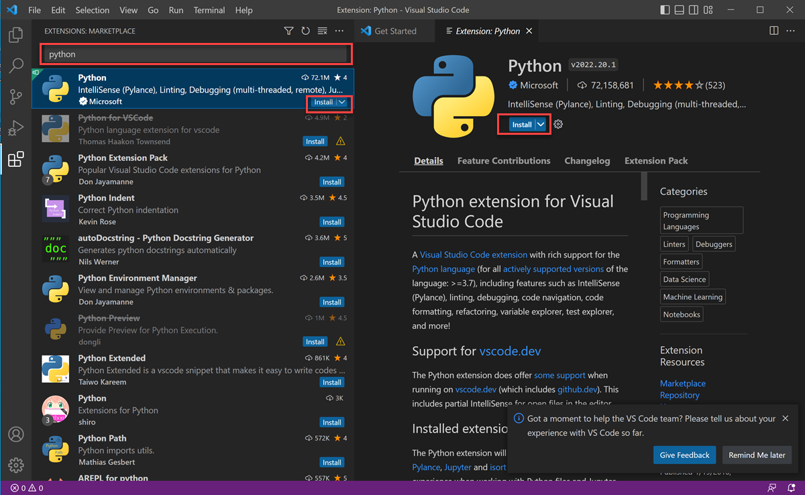
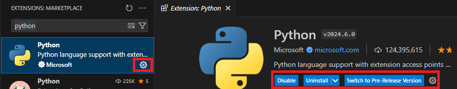

# Introduktion till Python

Python fungerar som ett mångsidigt och kraftfullt programmeringsspråk, likt en bro som underlättar kommunikation mellan människor och maskiner. Det möjliggör skapandet av läsbar och underhållbar kod som omvandlar abstrakta idéer till exekverbara kommandon, vilka datorer kan förstå och agera på. Detta språk nyttjas med andra ord som en medlare mellan dig och datorn som tar emot dina abstrakta instruktioner och tolkar dem till instruktioner som datorn kan förstå.

Pythons popularitet härstammar från dess breda tillämpningsområde, som sträcker sig från webbutveckling och dataanalys till artificiell intelligens och vetenskaplig databehandling. Denna omfattande användning stöds av ett stort utbud av bibliotek och ramverk, vilket ofta gör Python till ett föredraget val för både nybörjare och erfarna utvecklare.

{: .styled-image }

## Kom igång med Python

Det första steget när det kommer till programmering är att sätta upp miljön som man kommer att arbeta i, d.v.s. att vi laddar ned och installerar de verktyg som är nödvändiga för att tolka de kommandon vi anger i Python till maskinkod. Maskinkod är kortfattat det språk som datorer nyttjar och består av 1:or och 0:or. Istället för att vi själva ska behöva översätta Python-instruktioner till sådan maskinkod så använder man som programmerare sig utav s.k. kompilatorer - vilka kortfattat översätter våra instruktioner till faktiska kommandon som datorn kan tolka.

En utvecklingsmiljö (Integrated Development Environment) är ett program som hjälper utvecklare att skriva kod mer effektivt, exempelvis genom att språkgranska koden och ge förslag på ändringar - likt hur vi använder en ordbehandlare såsom Microsoft Word för att skriva och strukturera textdokument. En IDE har dessutom ofta en integrerad kompilator. D.v.s. att vi genom programmet dels får stöd i att skriva vår kod, men även att köra den (med andra ord, tillhandahålla instruktioner till datorn) - likt hur vi genom en ordbehandlare kan skapa en textfil som sedan kan användas i andra kontexter.

Vårt första steg på denna resa blir således att sätta upp vår utvecklingsmiljö som vi kommer att arbeta med för att skriva kod.

Vid slutet av detta kapitel så kommer du ha installerat samtliga verktyg som behövs för att bygga applikationer med Python och således genomföra denna kurs.

## Installation av Python och verktyg

Som nämnt behöver du installera ett par verktyg på din dator:

- Du behöver en Python-tolkare som kan kompilera och köra din kod och
- En utvecklingsmiljö (IDE) som assisterar dig i att skriva Python-kod.

### Steg 1: Ladda ner Python:

1. Besök [Pythons officiella webbplats](https://www.python.org/).
2. Klicka på "Downloads"-fliken och välj den senaste versionen av Python (Python 3) för operativsystemet på din dator (Windows, macOS eller Linux).
3. Dubbelklicka på den nedladdade filen och följ installationsguiden. För Windows-användare, var noga med att markera rutan _"Add Python 3.x to PATH"_ under installationen för att göra Python lättillgängligt från kommandotolken.
4. Verifiera installationen genom att öppna kommandotolken (CMD på Windows, Terminal på macOS och Linux) och skriv `python --version` (eller `python3 --version` på vissa Linux-distributioner). Du bör se Python-versionen som svar, vilket bekräftar att installationen var framgångsrik.

Med Python installerat på ditt system kan du rikta uppmärksamheten mot att installera utvecklingsmiljön. När du arbetar med Python så skrivs kod i en Python-syntax inuti en textfil som sedan kan lagras på exempelvis din lokala hårddisk. Det är således tekniskt sett möjligt att skriva Python-kod i en textredigerare såsom Microsoft Word, men det avråds starkt. Detta då dessa textredigerare generellt tillämpar formateringsalternativ som kan leda till att den Python-kod du skriver inte kan tolkas av datorn när du kör dina program.

Vi väljer därför att arbeta i ett program som är framtaget just för att skriva kod, d.v.s. en IDE. Det finns flera olika IDE:er tillgängliga för Python och andra programmeringsspråk där en sådan är [Visual Studio Code (VSCode)](https://code.visualstudio.com/). Detta program är gratis och tillgängligt för operativsystemen Windows, macOS och Linux. Microsoft tillhandahåller dessutom ett Python-tillägg för VSCode, vilket erbjuder funktioner såsom syntaxmarkering, autoslutförande av kod, stöd för kodformatering och mer. Du är mer än välkommen att arbeta med en annan IDE (t.ex. [PyCharm](https://www.jetbrains.com/pycharm/)) eller till och med online kompilatorer (t.ex. [Replit](https://replit.com/languages/python3) eller [VSCode.dev](https://vscode.dev/)) om du föredrar det, men notera att vi i instruktioner och framtida kapitel kommer att utgå från en lokal installation av Visual Studio Code.

### Steg 2: Ladda ner och installera din utvecklingsmiljö (IDE):

1. Välj din utvecklingsmiljö (IDE)
2. Navigera till sidan för nedladdning av IDE:n (t.ex. [VSCode - Download](https://code.visualstudio.com/Download))
3. Välj rätt version av IDE:n. Om du exempelvis har operativsystemet Windows på din dator så väljer du Windows-versionen av utvecklingsmiljön.
4. Följ instruktionerna i installationsprogrammet. Du kommer bl.a. få välja vart du vill installera programmet, om du önskar få en genväg till programmet och dylikt.

### Steg 3: Installera tillägget Python i VSCode:

1. Öppna Visual Studio Code på din dator.
2. Navigera till tilläggsmenyn (Extensions) genom `View -> Extensions`

{: .styled-image }

Visual Studio Code Extensions-vyn listar installerade tillägg och rekommenderade tillägg, baserat på populäritet, på VS Marketplace.

3. Filtrera listan över tillgängliga tillägg genom att ange _"python"_ i sökrutan högst upp i tilläggsvyn.
4. Välj Python-tillägget publicerat av Microsoft (beskrivs som _IntelliSense (Pylance)_ och listas vanligtvis först i listan). Detaljerna om tillägget visas i en flikpanel till höger när du klickar på det.
5. Välj "Installera" i panelen Extensions.

{: .styled-image }

6. När installationen är klar ändras knappen "Installera" till en ikon för "Inställningar ⚙️" i tilläggsvyn. Vilket fungerar som en bekräftelse på att du har installerat Python-tillägget i VS Code.

{: .styled-image }

{: .warning } 
Om du arbetar i operativsystemet macOS så kan du se en dialogruta när du installerat tillägget vilken frågar dig om du vill installera kommandoradens utvecklarverktyg. Du bör då välja "Installera". Du måste godkänna licensavtalet för Command Line Tools och installationsprocessen kan ta upp till 20 minuter eller mer, beroende på din internetanslutning. När installationen är klar visas en dialogruta som anger att programvaran är installerad. Välj "Klar" för att fortsätta.

# Sammanfattning
Det här kapitlet introducerar dig till Python, ett av de mest populära och mångsidiga programmeringsspråken idag. Med Python kan du snabbt gå från att skriva enkla kommandon till att utveckla komplexa applikationer, tack vare dess enkla syntax och omfattande standardbibliotek. Genom att sätta upp din utvecklingsmiljö och utforska IDE:s, lägger du grunden för en framgångsrik resa inom programmering med Python.

För att utforska ämnet vidare och få praktisk vägledning, besök [Pythons officiella Getting Started-sida](https://www.python.org/about/gettingstarted/).