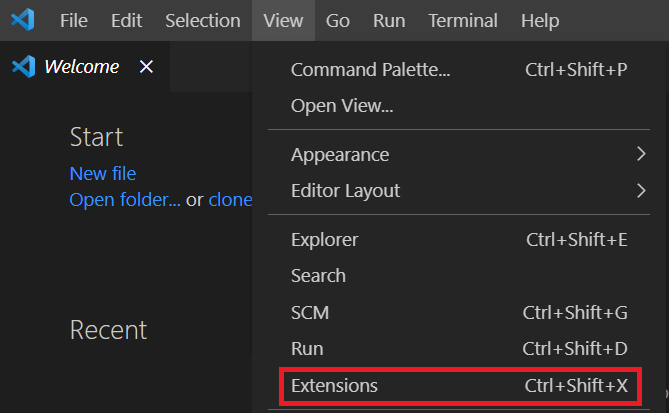

# Välkommen till den fängslande världen av Python-programmering!

Föreställ dig Python som din magiska översättare, som gör dina läsbara instruktioner till kommandon som datorn kan följa. Det är som att ha en trollkarl, men istället för trollformler skapar vi koder för att få datorn att göra vårt bud. Se Python som en vänlig guide som hjälper oss att kommunicera med maskinen för att utföra otroliga bedrifter.

Nu kanske du undrar, hur förstår Python vad vi vill ha? Det är som att ha en fantastisk konversation med en datorvän. När vi skriver `print("Hej, Python!")`, säger vi till Python att säga dessa ord högt, och magiskt svarar datorn genom att säga "Hej, tillbaka till dig!"

Men vänta, var skriver vi dessa magiska koder? Det är där våra speciella platser, kallade IDEs (Integrated Development Environments), kommer in i bilden. Föreställ dig en IDE som en mysig grotta där trollkarlar gör sin magi. Vår favorit-IDE är där vi skriver våra Python-trollformler och ser resultatet direkt! När vi ger oss ut på den här resan, låt oss reda ut kodningens mysterier och upptäcka magin med Python – ett språk designat för dess enkelhet och mångsidighet.

## Kom igång med Python

Det första steget när det kommer till programmering är att sätta upp miljön som man kommer att arbeta i, d.v.s. att vi laddar ned och installerar de verktyg som är nödvändiga för att tolka de kommandon vi anger i Python till maskinkod. Maskinkod är kortfattat det språk som datorer nyttjar och består av 1:or och 0:or. Istället för att vi själva ska behöva översätta Python-instruktioner till sådan maskinkod så använder man som programmerare sig utav s.k. kompilatorer - vilka kortfattat översätter våra instruktioner till faktiska kommandon som datorn kan tolka.

En utvecklingsmiljö (Integrated Development Environment) är ett program som hjälper utvecklare att skriva kod mer effektivt, exempelvis genom att språkgranska koden och ge förslag på ändringar - likt hur vi använder en ordbehandlare såsom Microsoft Word för att skriva och strukturera textdokument. En IDE har dessutom ofta en integrerad kompilator. D.v.s. att vi genom programmet dels får stöd i att skriva vår kod, men även att köra den (med andra ord, tillhandahålla instruktioner till datorn) - likt hur vi genom en ordbehandlare kan skapa en textfil som sedan kan användas i andra kontexter.

Vårt första steg på denna resa blir således att sätta upp vår utvecklingsmiljö som vi kommer att arbeta med för att skriva kod.

Vid slutet av detta kapitel så kommer du ha installerat samtliga verktyg som behövs för att bygga applikationer med Python och således genomföra denna kurs.

### Installation av Python och verktyg

Som nämnt behöver du installera ett par verktyg på din dator:

- Du behöver en Python-tolkare som kan kompilera och köra din kod och
- En utvecklingsmiljö (IDE) som assisterar dig i att skriva Python-kod.

#### Steg 1: Ladda ner Python:

1. Besök [Pythons officiella webbplats](https://www.python.org/) för att ladda ner och installera Python på din dator.
2. Klicka på "Downloads"-fliken och välj den senaste versionen för operativsystemet på din dator (Windows, macOS eller Linux).
3. Klicka på den länk som dyker upp efter 2. och följ installationsinstruktionerna.

Med Python installerat på ditt system kan du rikta uppmärksamheten mot att installera utvecklingsmiljön. När du arbetar med Python så skrivs kod i en Python-syntax inuti en textfil som sedan kan lagras på exempelvis din lokala hårddisk. Det är således tekniskt sett möjligt att skriva Python-kod i en textredigerare såsom Microsoft Word, men det avråds starkt att du gör det. Detta då dessa textredigerare generellt tillämpar formateringsalternativ som kan leda till att den Python-kod du skriver inte kan tolkas av datorn.

Vi väljer därför att arbeta i ett program som är framtaget just för att skriva kod, d.v.s. en IDE. Det finns flera olika IDE:er tillgängliga för Python och andra programmeringsspråk där ett sådant är [Visual Studio Code (VSCode)](https://code.visualstudio.com/). Detta program är gratis och tillgängligt för operativsystemen Windows, macOS och Linux. Microsoft tillhandahåller dessutom ett Python-tillägg för VSCode, vilket erbjuder funktioner såsom syntaxmarkering, autoslutförande av kod, stöd för kodformatering och mer. Du är dock välkommen att välja att arbeta med en annan IDE (t.ex. [PyCharm](https://www.jetbrains.com/pycharm/)) om du föredrar det. I instruktionerna nedan så kommer vi dock utgå från VSCode.

#### Steg 2: Ladda ner och installera din utvecklingsmiljö (IDE):

1. Välj din utvecklingsmiljö (IDE)
2. Navigera till sidan för nedladdning av IDE:n (t.ex., [VSCode - Download](https://code.visualstudio.com/Download))
3. Välj rätt version av IDE:n. Om du exempelvis har operativsystemet Windows på din dator så väljer du Windows-versionen av utvecklingsmiljön.
4. Följ instruktionerna i installationsprogrammet. Du kommer bl.a. få välja vart du vill installera programmet, om du önskar få en genväg till programmet och dylikt.

#### Steg 3: Installera tillägget Python i VSCode:

1. Öppna Visual Studio Code på din dator.
2. Navigera till tilläggsmenyn (Extensions) genom `View -> Extensions` (se Figur 1)

{: .styled-image }

Visual Studio Code Extensions-vyn listar installerade tillägg och rekommenderade tillägg, baserat på populäritet, på VS Marketplace.

3. Filtrera listan över tillgängliga tillägg genom att ange "python" i sökrutan högst upp i tilläggsvyn.
4. Välj Python-tillägget publicerat av Microsoft (beskrivs som IntelliSense (Pylance) och listas vanligtvis först i listan). Detaljerna om tillägget visas i en flikpanel till höger när du klickar på det.
5. Välj "Installera" i panelen Extensions.
6. När installationen är klar ändras knappen "Installera" till en ikon för "Inställningar ⚙️" i tilläggsvyn. Det här agerar bekräftelse på att du har installerat Python-tillägget.

    <strong>Note:</strong> OBS! Om du arbetar i operativsystemet macOS så kan du se en dialogruta när du installerat tillägget vilken frågar dig om du vill installera kommandoradens utvecklarverktyg. Du bör då välja "Installera". Du måste godkänna licensavtalet för Command Line Tools och installationsprocessen kan ta upp till 20 minuter eller mer, beroende på din internetanslutning. När installationen är klar visas en dialogruta som anger att programvaran är installerad. Välj "Klar" för att fortsätta.

 
