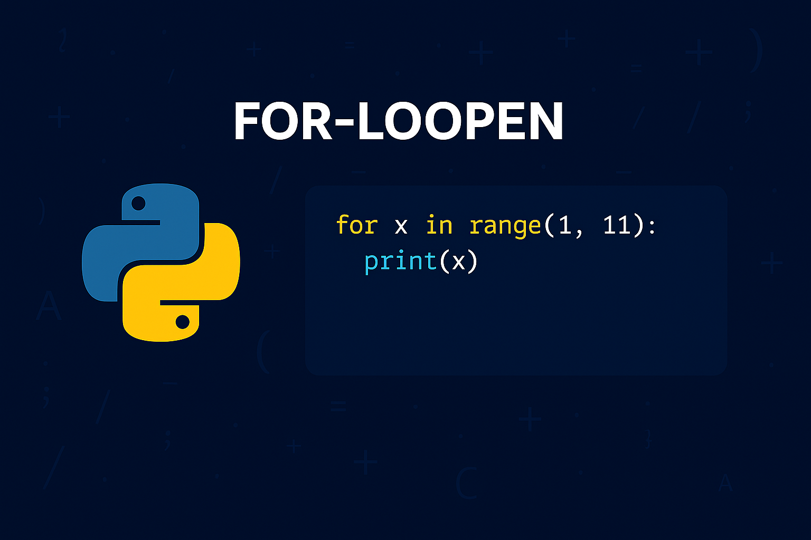
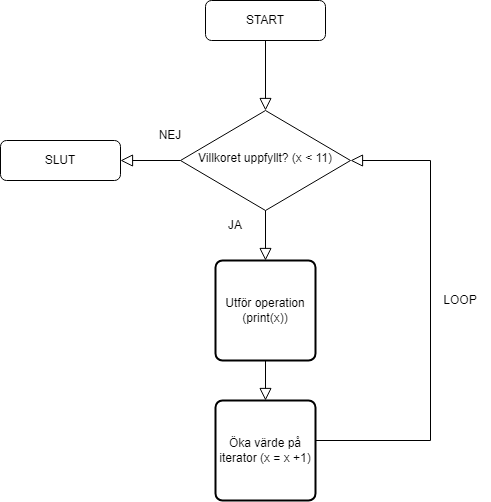

# `for`-loop:en
Nyckelordet `for` används för att deklarera en s.k. `for-loop` och följs alltid av ett _villkor_, likt en `if`-sats. Villkoret för en `for-loop` avser däremot inte ett "vägval" utan istället hur många _iterationer_ som ska utföras, d.v.s. hur många gånger koden som loop:en avser ska utföras. I det föregående exemplet så nyttjades villkoret `x in range(1,11)` - vilket kan översättas till `"SÅ LÄNGE SOM x ÄR INOM INTERVALLET 1-11"`.

{: .styled-image }

När vi först utför kodraden där `for-loop:en` är deklarerad så kommer vi att utvärdera om villkoret uppfylls eller ej. För villkoret i det föregående exemplet så kommer vi med andra ord att kontrollera huruvida 1 är mindre än 11 (1 < 11). Nästa gång kollar vi istället om 2 < 11, osv. När vi avslutningsvis når heltalet 11 så kommer villkoret inte att uppfyllas då 11 inte är mindre än 11, vilket medför att loop:en avslutas. Detta kan illustreras på följande vis:

{: .styled-image }

## Syntax för `for`-loop:ar
`for`-nyckelordet används tillsammans med nyckelordet `in` enligt:
```python
for variable in sequence:
    # Code that is to be repeated each iteration.
```

Där `sequence` avser något som innehåller multipla värden, t.ex. som en kollektion av data, ett intervall av heltal eller en sträng. Vi måste med andra ord inte tillämpa `range()`-funktionen för att skriva en korrekt `for-loop`. Exempelvis skulle vi kunna iterera över alla bokstäver i ett ord enligt:
```python
word = "Python"
for letter in word:
  print(letter)
```
<div class="code-example" markdown="1">
<pre><code>P
y
t
h
o
n</code> </pre>
</div>

Alla rader som är indenterade efter `for-loop:en` representerar den operation/de operationer som tillhör `for-loop:en` - d.v.s. den kod som ska utföras om villkoret uppfylls. `for-loop:en` och dess operationer avslutas på den rad man slutar indentera koden:
```python
print("Loop starting.")     # Does not belong to the loop. I.e., this will run regardless.
for n in range(1,6):
  print(n)
  print(n + 3)
  print("Number printed")

print("Loop finished.")     # Does not belong to the loop. I.e., this will run regardless.
```
<div class="code-example" markdown="1">
<pre><code>Loop starting.
1
4
Number printed
2
5
Number printed
3
6
Number printed
4
7
Number printed
5
8
Number printed
Loop finished.</code> </pre>
</div>

## Nästlad iteration för `for`-loop:ar
Nästlad iteration innefattar att man deklarerar en loop inuti en annan loop. Detta medför att den "inre" loop:en kommer att utföras för varje iteration i den "yttre" loop:en. Vi kan exempelvis nyttja detta för att formatera utskrifter enligt:
```python
for i in range(4):           # The outer loop handles rows
    for j in range(4):       # The inner loop handles columns/content per row
        print('*', end=' ')  # Prints a * and removes linebreaks using the end attribute
    print()                  # When all * of a row has been printed, linebreak here
```
<div class="code-example" markdown="1">
<pre><code>* * * *
* * * *
* * * *
* * * * </code> </pre>
</div>

{: .highlight }
`print()` kommer alltid att tillämpa radbrytning som standard. Om man vill frångå detta, d.v.s. om man vill fortsätta skriva mot samma rad, så kan parametern `end` nyttjas för att skriva över standardvärdet - t.ex. med ett `' '` som i ovan exempel.

## `range()`-funktionen
`range()`-funktionen i Python spelar en avgörande roll när det kommer till iteration, särskilt i kombination med `for`-loop:ar. Den möjliggör generering av en sekvens av tal, vilket är användbart i många programmeringsscenarier, från att utföra en uppgift ett visst antal gånger till att iterera över index i en lista eller annan datastruktur.

I sin enklaste form tar `range()` en enda parameter och genererar en sekvens från 0 upp till men **inte** inkluderande det angivna talet.
```python
for i in range(5):
    print(i)
```
<div class="code-example" markdown="1">
<pre><code>0
1
2
3
4</code> </pre>
</div>

`range()` kan även ta emot två parametrar där den första anger startpunkten för sekvensen och den andra avser slutpunkten. 
```python
for i in range(2, 6):
    print(i)
```
<div class="code-example" markdown="1">
<pre><code>2
3
4
5</code> </pre>
</div>

Det finns även en tredje parameter för stegintervall, vilket avser ökningen mellan varje tal i sekvensen. Detta kan exempelvis tänkas vara användbart för att hoppa över vissa tal:
```python
for i in range(0, 10, 2):
    print(i)
```
<div class="code-example" markdown="1">
<pre><code>0
2
4
6
8</code> </pre>
</div>

Eller för att iterera baklänges:
```python
for i in range(5, 0, -1):
    print(i)
```
<div class="code-example" markdown="1">
<pre><code>5
4
3
2
1</code> </pre>
</div>

Funktionen `range()` är således ovärderlig när du behöver en enkel och läsbar loop för att iterera ett bestämt antal gånger. Den eliminerar behovet av att manuellt skapa en kollektion med sekventiella tal, vilket förenklar koden och gör den mer effektiv. Dess flexibilitet med start, stopp och stegparametrar gör det möjligt att anpassa iterationen till en mängd olika behov, från enkla upprepningar till mer komplexa iterationsscheman.

# Sammanfattning
`for`-loop:ar är ett kraftfullt verktyg i Python som möjliggör effektiv iteration över sekvenser, inklusive numeriska intervall och datastrukturer som listor, tupler och dictionaries. Genom att använda `for`-loop:ar kan vi skriva kod som är både lättläst och effektiv, vilket eliminerar behovet av att manuellt upprepa kodblock.

`range()`-funktionen spelar en central roll i att skapa numeriska sekvenser för iteration, och möjligheten att ange startpunkt, slutpunkt och stegintervall gör det till ett flexibelt verktyg för att skapa skräddarsydda sekvenser.

Genom att förstå och utnyttja dessa iterationstekniker kan utvecklare bygga kraftfulla program som effektivt kan navigera och bearbeta samlingar av data.