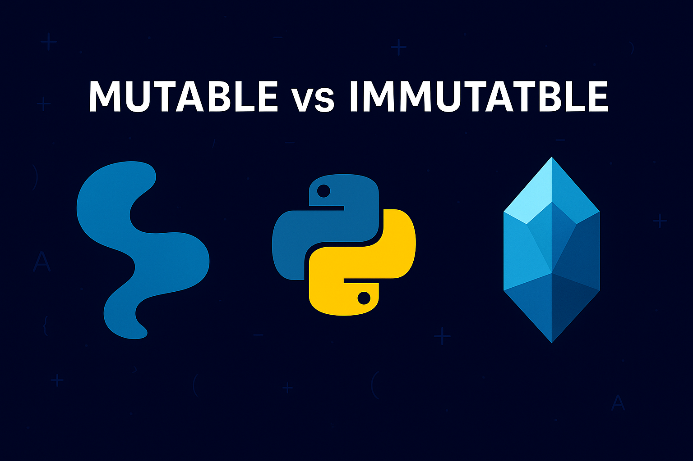
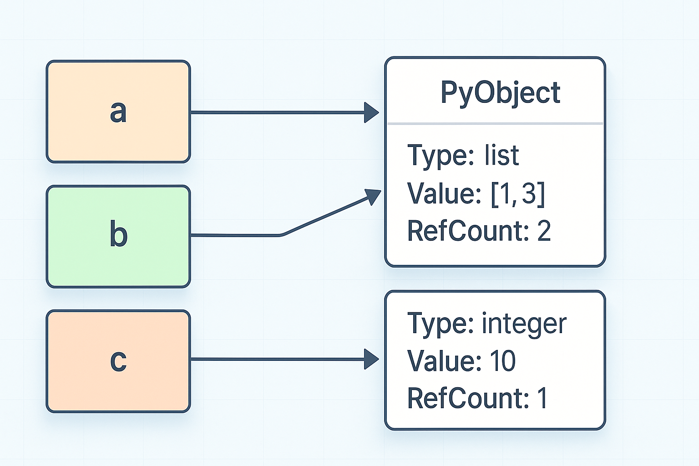

# Mutabla och immutabla typer
När du skriver exempelvis `a = [1,2,3]` så skapas i praktiken en liten "låda" i datorns minne. Variabeln `a` agerar som ett namn eller en etikett på denna låda, men innehållet inuti lådan kan förändras, t.ex. genom att saker läggs till eller tas bort. Detta kännetecknar _mutabla typer_.

Om du i stället skriver `x = 7` så skapas också en ny "låda" i datorns minne, men talet `7` går aldrig att förändra. Istället skapas en ny låda varje gång du ger variablen ett nytt värde, vilket kännetecknar _immutabla typer_.

Att förstå varför vissa lådor kan ändras och andra inte är viktigt när du konstruerar större program, för att undvika buggar, och för att lära dig hur Python hanterar sina objekt.

{: .styled-image }

## Exempel på mutabilitet
I Python arbetar alla variabler egentligen med _referenser till objekt i minnet_, inte med de faktiska värdena. När du exempelvis skriver:
```python
lst1 = [1, 2, 3]
lst2 = lst1        # lst1 & lst2 points to the same list
```
så pekar både `lst1` och `lst2` på exakt samma lista. Vi kan testa detta på följande vis:
 ```python
lst1 = [1, 2, 3]
lst2 = lst1        
lst2.append(4)
print(lst1)
```
<div class="code-example" markdown="1">
<pre><code>[1, 2, 3, 4]</code></pre>
</div>

Men om du däremot skriver:
```python
number1 = 10
number2 = number1
number2 += 1      # This creates a new "box" with 11
print(number1)
```
<div class="code-example" markdown="1">
<pre><code>10</code></pre>
</div>

Så har värdet på `number1` inte ändrats trots att vi tidigare har sagt att `number2` ska ges värdet av `number1`. Den här skillnaden i hur många namn kan peka på ett och samma objekt är central för att förstå _mutabla_ (föränderliga) och _immutabla_ (oföränderliga) typer.

{ .highlight }
Att Python, i syfte om att reducera onödig lagring, i många fall kan återanvända samma objekt internt. Exempelvis kan `x = 10` och `y = 10` avse två referenser för samma dataobjekt, då heltalet `10` alltid kommer vara heltalet `10`.

## Vad är "minne" i en dator?
Datorns minne (RAM) är kortfattat ett område där program och data lagras temporärt under körning. När du skapar och tilldelar en variabel ett värde så skapas ett objekt i minnet och variabeln får då en referens till just den platsen. 

Python hanterar själv allokeringen och frigöringing av dessa objekt åt dig, men för att översiktligt förstå _mutabilitet_ och delade referenser kan det tänkas vara behjälpligt att föreställa sig variabler som namn vilka pekar med pilar mot rutor i minnet, där det faktiska värdet finns lagrat.

{: .styled-image }

## Värde– och referenssemantik
När ett objekt är _immutabelt_ garanteras det att dess innehåll aldrig kan förändras efter att det skapats. Alla “ändringar” du gör, exempelvis som att byta ut en bokstav i en sträng eller addera 1 till ett heltal, skapar istället generellt sett ett nytt objekt i minnet. En _mutabel_ typ kan däremot uppdateras på samma plats i minnet, utan att ett nytt objekt skapas.

Du kan kontrollera om två variabler refererar till exakt samma objekt med den inbyggda funktionen `id()`:
```python
s1 = "hello"
s2 = "hello"
print(id(s1) == id(s2))

lst1 = [1, 2]
lst2 = [1, 2]
print(id(lst1) == id(lst2))
```
<div class="code-example" markdown="1">
<pre><code>True
False</code></pre>
</div>

Som vi kan se från ovan kodexempel så avser strängarna `s1` resp. `s2` samma objekt i minnet då dessa - för tillfället - avser samma värde. `lst1` resp. `lst2`, som båda är av den föränderliga typen `list`, kommer dock istället att skapas och lagras som två olika objekt i minnet.

## Immutabla typer = oföränderliga objekt
De vanligaste _immutabla typerna_ i Python är heltal (`int`), flyttal (`float`), strängar (`str`) och tuples (`tuple`). Eftersom dessa objekt aldrig kan ändras, kan Python ibland cacha och dela dem i syfte om att spara på minnesutrymmet och därmed öka prestandan (som vi såg i ovan exampel). När du sedan vill “uppdatera” en sträng eller ett tal så kommer det automatiskt att skapas ett nytt objekt:
```python
text = "abc"
text2 = text
print(id(text) == id(text2))   
text2 += "d"
print(id(text) == id(text2))   
```
<div class="code-example" markdown="1">
<pre><code>True
False</code></pre>
</div>

## Mutabla typer = föränderliga objekt
Istället för att skapa ett nytt objekt när innehållet ändras, kommer _mutabla typer_ att uppdateras direkt. Listor (`list`), dictionaries (`dict`) och mängder (`set`) är exempel på föränderliga objekt:
```python
data = [1, 2, 3]
print(id(data))         
data.append(4)          
print(data, id(data))   
```
<div class="code-example" markdown="1">
<pre><code># T.ex. 4299782080
[1, 2, 3, 4], 4299782080</code></pre>
</div>

Trots att listan `data` har förändrats genom tillägget så pekar vi alltså fortfarande på samma lista i minnet. Det bör även nämnas att eftersom flera variabler kan peka på samma föränderliga objekt så behöver du ha ha i åtanke att en mutation (förändring) via det ena namnet/variabeln för ett objekt kommer även att andra namn/variabler för samma objekt: 
```python
dict1 = {"example": 1}
dict2 = dict1
dict2["example"] = 3
print(dict1)
```
<div class="code-example" markdown="1">
<pre><code>3</code></pre>
</div>

### Kopiering och sidoeffekter
Om du vill undvika att en funktion eller en annan del av koden förändrar ditt original-objekt så kan du uppnå detta genom att skapa en kopia med modulen `copy`. Exempelvis kan du skapa en kopia av en lista(`list.copy()`) eller en dictionary (`dict.copy()`) vilket kommer att duplicera själva behållaren för objektet på följande vis:
```python
import copy

original = [1, 2]
copy_of_original = original.copy()
print(id(original) == id(copy_of_original))
copy_of_original.append(99)
print(original) 
print(copy_of_original) 
```
<div class="code-example" markdown="1">
<pre><code>False
[1, 2]
[1, 2, 99]</code></pre>
</div>

{ .highlight }
Som vi kan se dels från det faktum att `original` och `copy_of_original` innehåller olika värden men också från att de inte längre har samma id så pekar dessa variabler på olika objekt i minnet.

## Immutabla typer som nycklar
Endast immutabla objekt kan användas som nycklar i en dictionary eller som element i ett set (en mängd). Python kräver nämligen att dessa objekt ska behålla sin plats (eller mer precist, sin hashning) i minnet under hela objektets livstid. Det är därför exempelvis inte möjligt att använda en lista som en nyckel, men det är fullt möjligt att använda en tuple eller ett heltal:
```python
dict1[(1, 2)] = "tuple as key"
print(dict1[(1, 2)])

dict1[1] = "int as key"
print(dict1[1])

dict1[[10, 20]] = "list as key"
print(dict1[[10, 20]])
```
<div class="code-example" markdown="1">
<pre><code>tuple as key
int as key
TypeError: unhashable type: 'list'</code></pre>
</div>

Samma princip gäller för element i mängder (sets), där resp. element alltså måste vara en oföränderlig typ:
```python
set1 = { True }
set1.add("red")
print(set1)

set1.add((1, 2))
print(set1)

set1.add([10, 20])
print(set1)
```
<div class="code-example" markdown="1">
<pre><code>{ True, "red"}
{ True, (1,2), "red"}
TypeError: unhashable type: 'list'</code></pre>
</div>

# Sammanfattning
I detta kapitel såg vi hur Python-variabler alltid refererar till objekt i minnet, och att objektens _"mutabilitet"_ (föränderlighet) avgör om de kan förändras på samma plats i minnet eller ej. _Immutabla typer_ (t.ex. `int`, `str`, `tuple`) skapar alltid nya objekt när “ändringar” sker, medan _mutabla typer_ (t.ex. `list`, `dict`, `set`) istället uppdateras direkt utan att nya objekt skapas. 

För att undvika oönskade sidoeffekter kan du vid behov _kopiera mutabla objekt_ med hjälp av `copy`-modulen, och du bör alltid använda _immutabla typer_ som nycklar i dictionaries eller som element i set för att undvika `TypeErrors`. Genom att förstå värde- och referenssemantik samt _mutabilitet_ kommer du att kunna skriva mer förutsägbar och robust Python-kod.