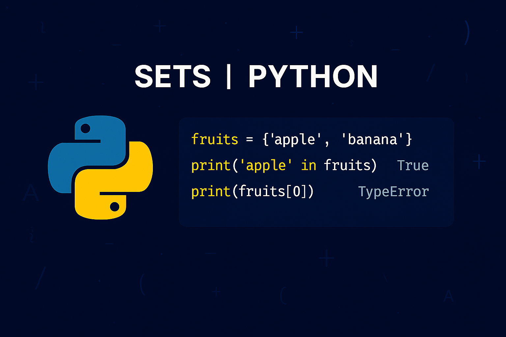

# Mängder (sets)
Mängder är en annan typ av kollektion som är mycket användbar när du behöver hantera _unika element_ och utföra operationer såsom `union`, `snitt` och `differens`. Mängder skapas med måsvingar `{}` eller med `set()`-funktionen. Till skillnad från listor och tuples är mängder _oordnade_, vilket innebär att de inte har någon bestämd ordning (d.v.s. att indexering inte kan tillämpas) för sina element och tillåter **inte** för duplicerade element. Mängder är även _oföränderliga_ i det avseendet att vi inte kan ändra på existerande element - men vi kan till skillnad mot tuples lägga till eller ta bort element.

{: .styled-image }

## Mängdmetoder
Vi kan arbeta med mängder på följande vis:
```python
# Create a set
colors = {"red", "green", "blue"}

# Add an element
colors.add("yellow")

# Remove an element
colors.discard("green")

# Itererate over a set
for color in colors:
    print(color)

# Indexing will cause a TypeError
print(colors[0])
```
<div class="code-example" markdown="1">
<pre><code>red
blue
yellow
TypeError: 'set' object is not subscriptable</code></pre>
</div>

{: .highlight }
Notera att då mängder är oordnade så kan vi aldrig vara säkra på i vilken ordning elementen kommer att skrivas ut. D.v.s. att den ena körningen kan vi få `red`, `blue`, `yellow` men nästa körning kan det vara `yellow`, `red`, `blue`.

## Mängdoperationer
Mängder stöder flera kraftfulla operationer som gör dem idealiska för att hantera unika element och utföra matematiska mängdoperationer såsom `union`, `snitt` och `differens`. 

* `Union` (`|`): <br>
Kombinerar element från två mängder utan dupliceringar.
    ```python
    study_group_a = {"Alice", "Bob", "Charlie"}
    study_group_b = {"Bob", "Diana", "Frank"}

    print(study_group_a | study_group_b)
    ```
    <div class="code-example" markdown="1">
    <pre><code>{'Frank', 'Diana', 'Charlie', 'Bob', 'Alice'}</code></pre>
    </div>

* `Snitt` (`&`): <br>
Hittar gemensamma element i två mängder.
    ```python
    study_group_a = {"Alice", "Bob", "Charlie"}
    study_group_b = {"Bob", "Diana", "Frank"}

    print(study_group_a & study_group_b)
    ```
    <div class="code-example" markdown="1">
    <pre><code>{'Bob'}</code></pre>
    </div>

* `Differens` (`-`): <br>
Hittar element i en mängd som inte finns i den andra.
    ```python
    study_group_a = {"Alice", "Bob", "Charlie"}
    study_group_b = {"Bob", "Diana", "Frank"}

    print(study_group_a - study_group_b)
    ```
    <div class="code-example" markdown="1">
    <pre><code>{'Alice', 'Charlie'}</code></pre>
    </div>

* `Symmetrisk Differens` (`^`): <br>
Hittar element som är unika för varje mängd.
    ```python
    study_group_a = {"Alice", "Bob", "Charlie"}
    study_group_b = {"Bob", "Diana", "Frank"}

    print(study_group_a ^ study_group_b)
    ```
    <div class="code-example" markdown="1">
    <pre><code>{'Alice', 'Diana', 'Charlie', 'Frank'}</code></pre>
    </div>

## Användningsområden för mängder
Mängder är särskilt användbara i följande scenarier:

* Undvika duplicerade element: <br>
Perfekt när du behöver säkerställa att varje element är unikt. Exempelvis kan det vara lämpligt att typkonvertera från en lista till en mängd och sedan tillbaka till en lista om man vill eliminera duplicerade element.

* Effektiv sökningsprestanda: <br>
Mängder är optimerade för att snabbt kontrollera om ett element finns, vilket sker mycket snabbare än vad det gör för t.ex. listor.

* Matematiska mängdoperationer: <br>
Mängder är idealiska för att lösa problem som involverar `union`, `snitt` och `differens` mellan grupper av data.

# Sammanfattning
Mängder i Python är en kraftfull datastruktur för hantering av unika element. De erbjuder både flexibiliteten att lägga till och ta bort element (till skillnad från tuples) och har prestandan för snabba sökningar och mängdoperationer. 

Genom att använda mängder och deras inbyggda operationer och metoder, kan du skriva mer effektiv och läsbar kod för att lösa problem som involverar unika element och grupper av data.