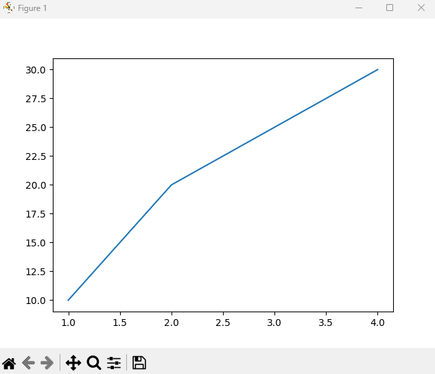

# Virtuella miljöer och pakethantering (package management)
När du arbetar med Python-projekt, särskilt de som inkluderar externa bibliotek eller moduler, är det viktigt att hantera beroenden på ett effektivt sätt. Virtuella miljöer och pakethantering är två centrala koncept som hjälper till med detta.

## Virtuella miljöer
_Virtuella miljöer_ i Python tillhandahåller en isolerad miljö för Python-projekt. Detta innebär att varje projekt kan ha sina egna beroenden, oavsett andra projektens beroenden. Det är särskilt användbart när två eller fler projekt kräver olika versioner av samma paket. D.v.s. att vi kan lägga till bibliotek och moduler för ett enda Python-projekt utan att riskera att vi påverkar andra Python-projekt på samma dator.

För att skapa en virtuell miljö kan du använda kommandot `python venv` i terminalen från den mapp där du vill skapa den virtuella mappen. Om du t.ex. befinner dig i mappen Desktop i din terminal så kommer du att skapa den virtuella miljön där. som kommer förinstallerad med Python 3.3 och senare. Här är ett grundläggande exempel på hur du skapar och aktiverar en virtuell miljö:
```python
# Create a virtual environment in the folder 'my_project_env'
python -m venv my_project_env
```
Detta skapar en ny mapp med namnet `my_project_env` som innehåller en kopia av Python-tolkaren, `pip` (Python-pakethanteraren) och en samling standardbibliotek.

För att sedan aktivera den virtuella miljön så skriver du:
```python
# On Windows:
my_project_env\Scripts\activate.bat
# On Unix or macOS:
source my_project_env/bin/activate
```

När den virtuella miljön är aktiverad kan du installera och använda paket lokalt utan att påverka resten av ditt system eller andra projekt.

## Pakethantering med `pip`
`pip` är Pythons standardpaketinstallerare som låter dig installera, uppgradera och avinstallera Python-paket från Python Package Index (PyPI). Tillsammans med virtuella miljöer ger `pip` en kraftfull mekanism för att hantera projektberoenden.

För att installera ett paket med `pip`, använd följande kommando:
```python
pip install package_name
```

Där `package_name` är namnet på det paket du vill lägga till i ditt projekt, t.ex. `pytest` för testning.

Du kan även ange en specifik version av ett paket enligt:
```python
pip install package_name==1.2.3
```

### Paketberoenden och requirements.txt
För större projekt där du vill hålla reda på alla beroenden är requirements.txt-filen standard. Den innehåller en lista över alla paket som ditt projekt är beroende av, ofta med specifika versioner för att säkerställa kompatibilitet.

En requirements.txt kan se ut så här:
```python
flask==1.1.2
requests==2.24.0
```

D.v.s. att projektet är beroende utav `flask` och `requests`. Denna information lagras i filen requirements.txt (som du själv skapar och fyller i). Denna fil tillåter oss sedan att installera alla beroenden från ett projekt enligt:
```python
pip install -r requirements.txt
```

Vilket gör det enkelt att återskapa en projektmiljö.

### Hantera Paket
`pip` erbjuder även verktyg för att lista, uppgradera och avinstallera paket:

* Lista paket:
```python
pip list
```

* Uppgradera paket:
```python
pip install --upgrade package_name
```

* Avinstallera paket:
```python
pip uninstall package_name
```

## Vanliga Python-paket och deras användningsområden
Python-communityt har utvecklat ett stort antal kraftfulla paket som utökar språkets funktionalitet. Nedan är några populära paket som ofta används inom olika områden:

* `requests`: Enkla HTTP-förfrågningar
`requests` är ett populärt paket för att göra HTTP-förfrågningar. Det är känt för sin enkelhet och användarvänlighet jämfört med den inbyggda `urllib`.

```python
import requests

response = requests.get('https://api.example.com/data')
data = response.json()  # Assuming the response is in a JSON-format
print(data)
```
<div class="code-example" markdown="1">
<pre><code>{'page': 1, 'per_page': 6, 'total': 12, 'total_pages': 2, 'data': [{'id': 1, 'email': 'george.bluth@reqres.in', 'first_name': 'George', 'last_name': 'Bluth', 'avatar': 'https://reqres.in/img/faces/1-image.jpg'}, {'id': 2, 'email': 'janet.weaver@reqres.in', 'first_name': 'Janet', 'last_name': 'Weaver', 'avatar': 'https://reqres.in/img/faces/2-image.jpg'}, {'id': 3, 'email': 'emma.wong@reqres.in', 'first_name': 'Emma', 'last_name': 'Wong', 'avatar': 'https://reqres.in/img/faces/3-image.jpg'}, {'id': 4, 'email': 'eve.holt@reqres.in', 'first_name': 'Eve', 'last_name': 'Holt', 'avatar': 'https://reqres.in/img/faces/4-image.jpg'}, {'id': 5, 'email': 'charles.morris@reqres.in', 'first_name': 'Charles', 'last_name': 'Morris', 'avatar': 'https://reqres.in/img/faces/5-image.jpg'}, {'id': 6, 'email': 'tracey.ramos@reqres.in', 'first_name': 'Tracey', 'last_name': 'Ramos', 'avatar': 'https://reqres.in/img/faces/6-image.jpg'}], 'support': {'url': 'https://reqres.in/#support-heading', 'text': 'To keep ReqRes free, contributions towards server costs are appreciated!'}}</code></pre>
</div>

* `pandas`: Kraftfull dataanalys och manipulation
`pandas` är ett viktigt paket för dataanalys i Python och används för att hantera och analysera strukturerad data.

```python
import pandas as pd

# Read a CSV-file and transform it to a DataFrame
df = pd.read_csv('data.csv')
# Show the first few rows in the DataFrame
print(df.head())
```

* `numPy`: Vetenskaplig beräkning
`numPy` erbjuder stöd för stora, flerdimensionella arrayer och matriser, tillsammans med en samling av matematiska funktioner för att arbeta med dessa arrayer.

```python
import numpy as np

# Create a 2x2 numPy array
arr = np.array([[1, 2], [3, 4]])
# Calculate the determinant
print(np.linalg.det(arr))
```
<div class="code-example" markdown="1">
<pre><code>-2.0000000000000004</code></pre>
</div>

* `matplotlib`: Plottingbibliotek
`matplotlib` är det mest använda Python-biblioteket för att skapa 2D-plotter och diagram. Det kan användas för att visualisera data och resultat av analys.

```python
import matplotlib.pyplot as plt

x = [1, 2, 3, 4]
y = [10, 20, 25, 30]

plt.plot(x, y)
plt.show()
```
<div class="code-example" markdown="1">
<pre><code></code></pre>
</div>

* `flask`: Webbutveckling
`flask` är ett mikroramverk för webbutveckling i Python. Det är enkelt att komma igång med och kraftfullt nog för att bygga komplexa webbapplikationer.

```python
from flask import Flask

app = Flask(__name__)

@app.route('/')
def home():
    return "Hello, World!"

if __name__ == '__main__':
    app.run(debug=True)
```

# Sammanfattning
Förståelsen för virtuella miljöer och `pip` är central för att hantera Python-projekt effektivt. Genom att isolera projektberoenden till virtuella miljöer undviker du konflikter mellan olika projekt och säkerställer att ditt projekt kan replikeras och köras av andra utvecklare. `pip`, tillsammans med requirements.txt, gör det dessutom enkelt att hantera dessa beroenden och dela dem mellan utvecklare eller i produktionsmiljöer.

Genom att utforska och använda dessa paket kan du kraftigt utöka funktionaliteten i dina Python-program och säkerställa att dina projekt är enkla att underhålla och dela med andra. Varje paket är utformat för att lösa specifika uppgifter och underlätta utvecklingsprocessen. Som nybörjare i Python är det nyttigt att experimentera med dessa paket för att lära sig mer om deras potential och hur de kan integreras i dina projekt.