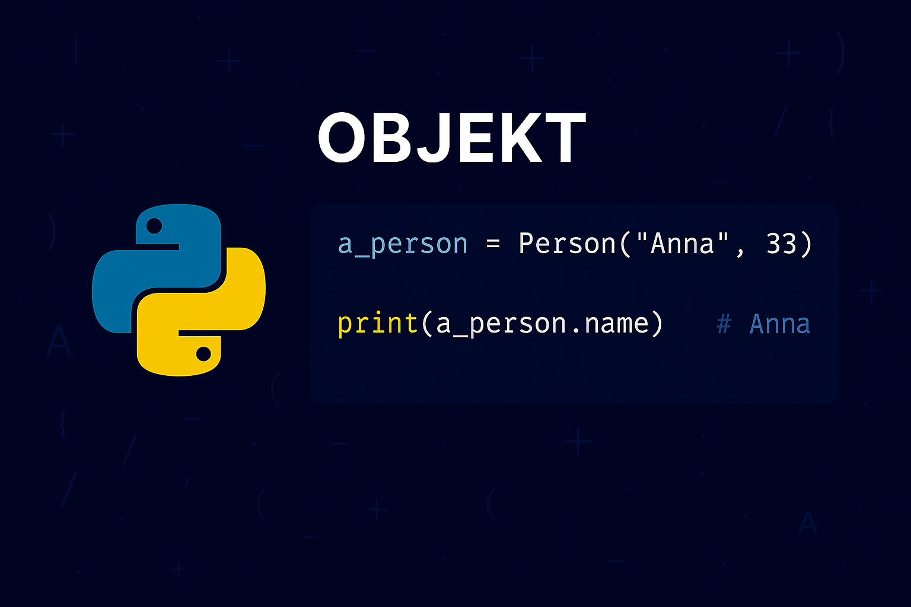

# Objekt i Python
För att kunna arbeta med klasser så måste vi skapa instanser av dessa klasser, d.v.s. att vi måste arbeta med _objekt_. Objekt används för att skapa dynamiska och interaktiva program och utgör de faktiska entiteterna i din kod som interagerar med varandra samt med systemets olika delar.

## Vad är ett objekt?
Ett objekt är som nämnt en _instans_ av en klass. Samtidigt som en klass definierar attribut och metoder, så skapar objektet en konkret representation av klassen med specifika värden och beteenden. Objektet _inkapslar_ alltså tillstånd (data) och beteende (funktioner/metoder) som definieras i dess klass.

{: .styled-image }

## Skapa objekt från klasser
För att använda klasser i ditt program måste du alltså skapa _instanser_ (_objekt_) från dem. Detta kallas för "instansiering" av en klass och när en klass instansieras så körs _konstruktorn_ (``__init__``-metoden) i klassen för att ställa in objektets initiala tillstånd - d.v.s. den data som objektet ska innehålla från start.

För att skapa ett objekt så används klassnamnet som om det vore en funktion. Exempelvis anger vi klassen `Car` som en funktion för att skapa en ny instans av en bil enligt:
```python
class Car:
    def __init__(self, make, model):
        self.make = make
        self.model = model

## Runs __init__ and sets make to "Volvo" & model to "S60" for this object
car_a = Car("Volvo", "S60")   
## Runs __init__ and sets make to "Toyota" & model to "Corolla" for this object      
car_b = Car("Toyota", "Corolla")
```

{: .highlight}
Tänk på att antalet argument måste matcha antalet parametrar angivna i `__init__`-deklarationen. Exempelvis skulle `car_a = Car()` i ovan fall resultera i ett felmeddelande.

Varje objekt representerar en unik instans av en klass, vare sig de råkar ha samma tillstånd eller data som ett annat objekt. Exempelvis kommer nedan att resultera i `False`:
```python
class Car:
    def __init__(self, make, model):
        self.make = make
        self.model = model
    
    def display_info(self):
        print(f"This car is a: {self.make} {self.model}")

car_a = Car("Volvo", "S60")      
car_b = Car("Volvo", "S60")
print(car_a == car_b)
```
<div class="code-example" markdown="1">
<pre><code>False</code></pre>
</div>

Genom den gemensamma klassen får vi alltså åtkomst till delade attribut och funktioner, men varje objekt är i sig självt unikt.

## Använda objekt
När ett objekt väl har instansierats så kan vi arbeta med objektet för att t.ex. anropa metoder eller manipulera attribut. Exempelvis kan vi ändra märket på en bil enligt:
```python
class Car:
    def __init__(self, make, model):
        self.make = make
        self.model = model
    
    def display_info(self):
        print(f"This car is a: {self.make} {self.model}")

car_a = Car("Volvo", "S60")      
print(car_a.make)
car_a.make = "Lexus"
print(car_a.make)
```
<div class="code-example" markdown="1">
<pre><code>Volvo
Lexus</code></pre>
</div>

### Punktnotation
För att nå och arbeta med ett objekts metoder eller attribut så nyttjas punktnotation. Som vi kan se i ovan exempel så kan vi exempelvis nå attributet `make` för ett bilobjekt genom att skriva objektets namn följt av `.make`.

För att exempelvis anropa en instansmetod så skulle vi alltså kunna skriva något i stil med:
```python
class Car:
    def __init__(self, make, model):
        self.make = make
        self.model = model
    
    def display_info(self):
        print(f"This car is a: {self.make} {self.model}")

car_a = Car("Volvo", "S60")      
car_b = Car("Toyota", "Corolla")
car_a.display_info()
car_b.display_info()
```
<div class="code-example" markdown="1">
<pre><code>This car is a: Volvo S60
This car is a: Toyota Corolla</code></pre>
</div>

{: .highlight}
Vid metodanrop så behöver vi inte ange ett argument för `self`, trots att det är angivet som en parameter för metoden. Vi behöver enbart ange argument för andra eventuella parametrar, exempelvis som att vi behöver ange märke och modell när vi skapar en instans av `Car`. 

## Objektinteraktion
Objekt kan interagera med varandra genom deras metoder. Genom att exempelvis passera ett objekt som en parameter till en annan objekts metod kan objekt samverka på komplexa och intressanta sätt. Vi skulle exempelvis kunna skriva en metod som kontrollerar huruvida två bilar är av samma märke enligt:
```python
class Car:
    def __init__(self, make, model):
        self.make = make
        self.model = model
    
    def display_info(self):
        print(f"This car is a: {self.make} {self.model}")

    def compare_cars(self, car2):
        if self.make == car2.make:
            print("The cars have the same make.")
        else:
            print("The cars are of different makes.")

car_a = Car("Volvo", "S60")      
car_b = Car("Toyota", "Corolla")
car_c = Car("Volvo", "XC90")
car_a.compare_cars(car_b)
car_a.compare_cars(car_c)
```
<div class="code-example" markdown="1">
<pre><code>The cars are of different makes.
The cars have the same make.</code></pre>
</div>

# Sammanfattning
Att förstå och kunna skapa och använda objekt är kritiskt för att utveckla objektorienterade program i Python och att kunna arbeta med klasser och objekt gör även programmet mer modulärt, återanvändbart och lättförståeligt. 

Genom att initialisera objekt korrekt med `__init__` säkerställer du dessutom att din kod är robust, förutsägbar och lätt att underhålla. 

Avslutningsvis kan du genom praktisk användning av objekt kan du börja bygga mer komplexa och kraftfulla Python-applikationer. 