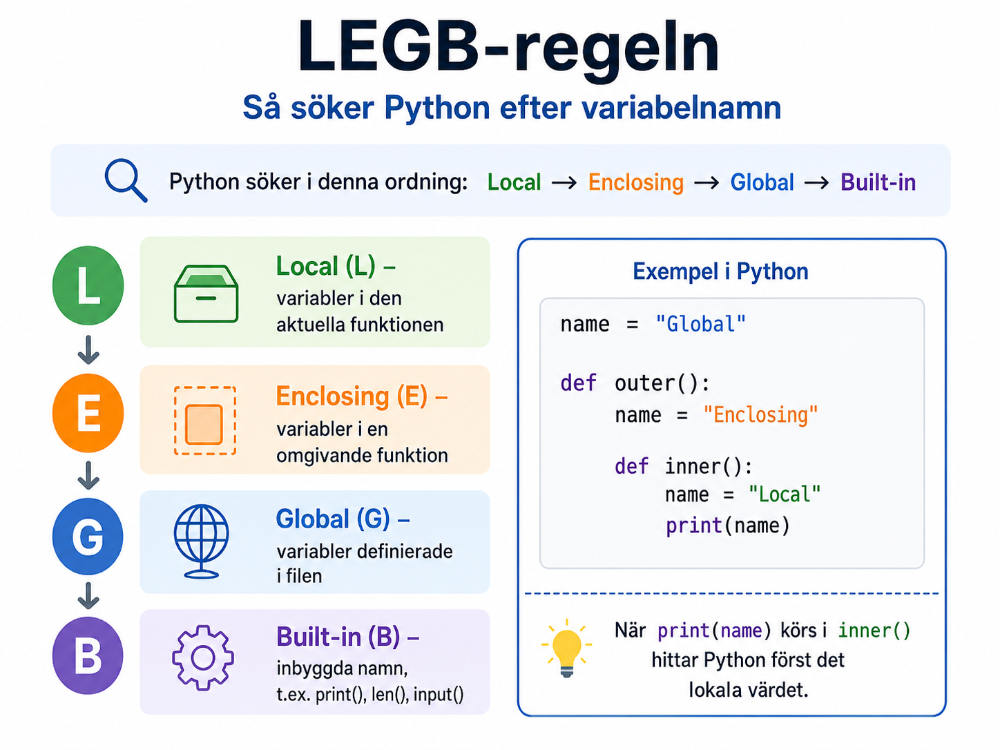

# Variabelscope och namnrymder
När vi skriver program skapar vi ofta variabler på flera olika platser. Ibland skapas de exempelvis direkt i filen, ibland inuti funktioner och ibland som parametrar till funktioner.

Python behöver därför ha _regler_ för var ett variabelnamn ska hämtas ifrån och dessa regler kallas generellt sett för _scope-regler_. Ett "scope" kan beskrivas som det område i programmet där ett visst namn är tillgängligt.

## Lokala variabler
En variabel som skapas inuti en funktion är normalt lokal för just den funktionen. Det innebär i praktiken att variabeln enbart existerar och kan användas inuti funktionen.
```python
def greet():
    message = "Hello!"
    print(message)

greet()
```
<div class="code-example" markdown="1">
<pre><code>Hello!</code></pre>
</div>

I ovan exempel deklareras variablen `message` inom funktionen `greet()` och agerar därför en lokal variabel till den funktionen. Om vi försöker nå denna variabel utanför funktionen så kommer vi dock att stöta på ett fel:
```python
def greet():
    message = "Hello!"
    print(message)

greet()
print(message)
```
<div class="code-example" markdown="1">
<pre><code>NameError: name 'message' is not defined</code></pre>
</div>

Felet uppstår eftersom `message` skapades __inuti__ funktionen `greet()` och existerar således inte utanför den kontexten.

## Globala variabler
En variabel som skapas utanför alla funktioner kallas istället ofta för en _global variabel_. Denna kan läsas inuti funktioner såväl som utanför dem:
```python
message = "Hello from outside!"

def greet():
    print(message)

greet()
```
<div class="code-example" markdown="1">
<pre><code>Hello from outside!</code></pre>
</div>

I ovan fall hittar Python variabeln `message` utanför funktionen, eftersom det inte finns någon lokal variabel med samma namn inuti funktionen.

### Lokal variabel med samma namn
Om vi däremot skapar en lokal variabel med samma namn som en global variabel så är det den lokala variablen som kommer att användas:
```python
message = "Global message"

def greet():
    message = "Local message"
    print(message)

greet()
print(message)
```
<div class="code-example" markdown="1">
<pre><code>Local message
Global message</code></pre>
</div>

I detta fall har vi alltså två olika variabler med samma namn där den ena är lokal för funktionen och den andra är global.

## LEGB-regeln
Python följer en viss ordning när ett namn ska hämtas och denna ordning brukar sammanfattas med förkortningen _LEGB_:

* L – Local: först letar Python i den aktuella funktionen.
* E – Enclosing: därefter letar Python i en eventuell omgivande funktion.
* G – Global: därefter letar Python på den globala nivån i filen.
* B – Built-in: slutligen letar Python bland inbyggda namn, såsom print, len och input.

{: .styled-image }

Ett enkelt exempel på denna regel kan tänkas te sig som:
```python
name = "Global"

def outer():
    name = "Enclosing"

    def inner():
        name = "Local"
        print(name)

    inner()

outer()
```
<div class="code-example" markdown="1">
<pre><code>Local</code></pre>
</div>

I detta scenario kommer Python först att hitta den lokala variabeln, `name`, inuti funktionen `inner()` och behöver därför inte leta vidare. Om vi däremot tar bort den lokala variabeln i `inner()` så kommer Python att söka sig vidare utåt:
```python
name = "Global"

def outer():
    name = "Enclosing"

    def inner():
        print(name)

    inner()

outer()
```
<div class="code-example" markdown="1">
<pre><code>Enclosing</code></pre>
</div>

Nu hittar Python istället `name` i den omgivande funktionen `outer()`, vilket ger oss utskriften `"Enclosing"`. Om även denna variabel tas bort så kommer den globala variabeln att nyttjas.

### Nyckelordet global
I vissa fall kan vi tänkas vilja ändra en global variabel inuti en funktion. I detta syfte kan man nyttja nyckelordet `global` i stil med:
```python
counter = 0

def increase_counter():
    global counter
    counter += 1

increase_counter()
increase_counter()

print(counter)
```
<div class="code-example" markdown="1">
<pre><code>2</code></pre>
</div>

Om vi inte använder nyckelordet `global` i ovan scenario så hade Python behandlat `counter` som en lokal variabel i funktionen när vi försöker tilldela den ett nytt värde (vilket hade resulterat i ett `UnboundLocalError`). 

{: .highlight }
Det är oftast fördelaktigt att försöka undvika globala variabler när det går. I ovan scenario hade vi exempelvis kunnat skicka med ett värde till funktionen i anropet och returnera det uppdaterade värdet. En sådan version är nämligen oftast enklare att förstå då funktionen tydligt tar emot ett värde och returnerar ett nytt värde.

### Nyckelordet nonlocal
Nyckelordet `nonlocal` används när vi har en funktion inuti en annan funktion och vill ändra en variabel från den omslutande/yttre funktionen. Exempelvis i stil med:
```python
def outer():
    counter = 0

    def inner():
        nonlocal counter
        counter += 1
        print(counter)

    inner()
    inner()

outer()
```
<div class="code-example" markdown="1">
<pre><code>1
2</code></pre>
</div>

Här säger `nonlocal counter` att variabeln `counter` inte ska behandlas som en lokal variabel för `inner()`-funktionen utan ska istället hämtas från den yttre funktionen `outer()`.

Detta är ett något avancerat fall och är sannolikt inget du kommer att stöta på när du arbetar mot grundläggande uppgifter, men det kan vara bra att känna till då felmeddelanden kopplade till scope ofta uppstår när man arbetar med funktioner.

## Vanliga misstag
Ett vanligt misstag är att tro att en variabel inuti en funktion automatiskt påverkar en variabel utanför funktionen:
```python
score = 0

def update_score():
    score = 10

update_score()
print(score)
```
<div class="code-example" markdown="1">
<pre><code>0</code></pre>
</div>

Variabeln `score` inuti funktionen är lokal, d.v.s. att den globala variablen inte kommer att påverkas. Om vi vill att funktionen ska förändra värdet på ett tydligt sätt bör vi istället returnera ett nytt värde i stil med:
```python
score = 0

def update_score():
    return 10

score = update_score()
print(score)
```
<div class="code-example" markdown="1">
<pre><code>10</code></pre>
</div>

## Rekommendationer

En bra utgångspunkt är att:

* skapa variabler så nära platsen där de används som möjligt,
* undvika globala variabler när det går,
* använda returvärden för att skicka tillbaka resultat från funktioner,
* använda tydliga variabelnamn så att det framgår vilket värde variabeln representerar.

# Sammanfattning
I detta kapitel har vi introducerat variabelscope och namnrymder. En lokal variabel existerar inuti en funktion, medan en global variabel finns på filens övergripande nivå. Python använder _LEGB_-regeln för att avgöra i vilken ordning namn ska hämtas: _Local_, _Enclosing_, _Global_ och _Built-in_.

Genom att förstå scope blir det lättare att förstå varför vissa variabler är tillgängliga på vissa platser men inte på andra. Det gör det också enklare att felsöka program där funktioner, parametrar och returvärden samverkar.