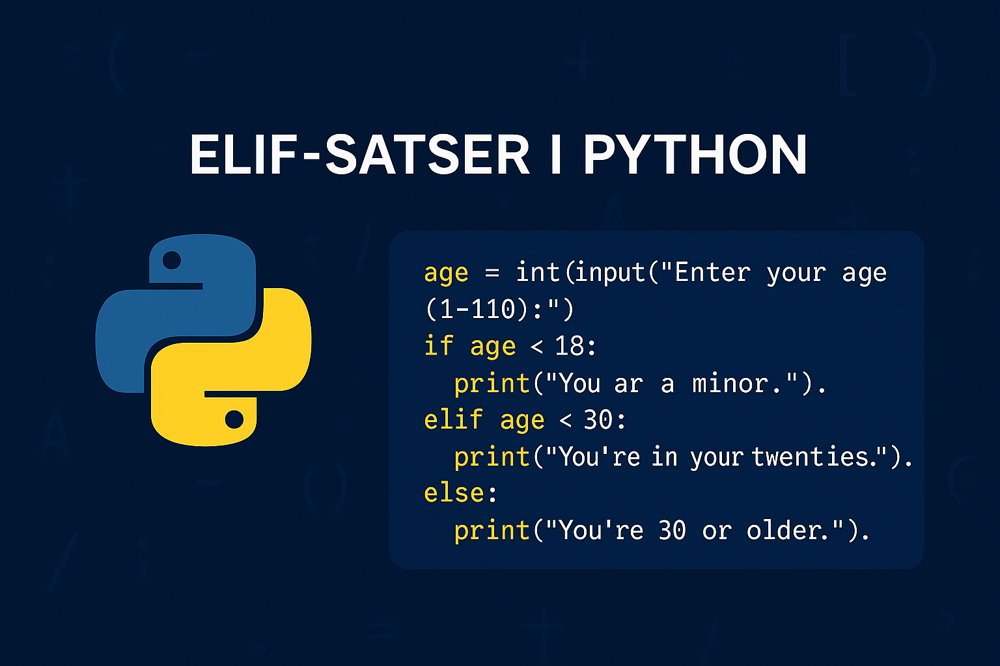

# `elif`-satser
En `elif`-sats i Python är ett valfritt tillägg som man använder när man vill att programmet ska utföra en operation i det fall när villkoret i en `if`-sats **inte** uppfylls, likt en `else`-sats. D.v.s. vilken kod som ANNARS ska utföras i de fall ett eller flera villkor inte uppfylls.

Skillnaden mot en `else`-sats är vi att vi med `elif`-satser kan ange _alternativa_ villkor.

{: .styled-image }

Låt oss återigen utgå från vårt tidigare exempel avseende transaktionskontot och produktköpet:
```python
if accountCredit >= priceOfProduct:
  accountCredit = accountCredit - priceOfProduct 
  print("Transaction successful")

else:
  print("Transaction failed.")
```

Ponera nu att vi vill erbjuda en rabatt om en viss procentsats beroende på olika prisnivåer, t.ex. ska 5% dras av från kostnaden om priset är över 500kr, 10% vid 1000kr osv. upp till och med 30%. Vi kan då uppnå detta i stil med:
```python
if accountCredit >= priceOfProduct:
  discount = 0

  if priceOfProduct > 500 and priceOfProduct <= 1000:
    discount = 0.05
    
  elif priceOfProduct > 1000 and priceOfProduct <= 1500:
    discount = 0.10

  # Etc. for other price levels.

  accountCredit = accountCredit - (priceOfProduct - (priceOfProduct * discount))
  print("Transaction successful")

else:
  print("Transaction failed.")
```

Vi kontrollerar fortfarande initialt att vi har täckning på kontot för att utföra transaktionen. Om så är fallet så lägger vi senda till en variabel som avser rabatten, `discount`, och ger den det initiala värdet 0. Vi kontrollerar sedan huruvida `priceOfProduct` förhåller sig till en prisnivå och tilldelar ett nytt värde till `discount` beroende vilken prisnivå det gäller. `(priceOfProduct - (priceOfProduct * discount))` kommer att fungera vare sig en prisnivå har uppfyllts eller ej då vi antingen subtraherar 0 eller ett specifikt belopp från produktpriset.

## Syntaxen för `elif`-satser
En `elif`-sats kan inledningsvis bara existera om det finns en tillhörande `if`-sats. Det är med andra ord inte möjligt att erbjuda ett alternativt vägval om det inte redan finns vägval. 

Syntaxen för en `elif`-sats påminner om syntaxen för `if`-satser:
```python
if villkorA:
  Operation1
  Operation2
  ...
elif villkorB:
  Operation1
  Operation2
  ...
```

En `elif`-sats representerar vad som ska ske om ett specifikt villkor inte uppfylls och vi vill kunna erbjuda alternativa vägval. Likt `if`-satser så tillhör samtliga operationer som är indenterade under `elif`-satsen det vägvalet. Notera gärna även att `elif`-satser anges på samma _hierarkiska nivå_ som den tillhörande `if`-satsen. En `elif`-sats anges dessutom alltid EFTER en `if`-sats.
```python
elif 5 > 3:   # Non-acceptable syntax as elif is placed before if
if 10 > 5: 

if 10 > 5:    # Acceptable syntax
  Operation1
elif 5 > 3:
  Operation2

elif 5 > 3:   # Non-acceptable syntax as we're missing an if
```
Notera att både `elif`- och `else`-satser är frivilliga tillägg till en `if`-sats. D.v.s. att vi kan ha enbart en `if`-sats, en `if`-sats med en `elif`-sats _utan_ en `else`-sats, en `if`-sats med en `else`-sats _utan_ en `elif`-sats, osv.

{: .highlight }
En `elif`-sats representerar ett **ANNARS OM**-fall i vårt program, d.v.s. det som ska utvärderas om ett specifikt villkor inte uppfylls. Det är således omöjligt att ange dem utan tillhörande `if`-satser.

## Multipla `elif`-satser
`elif`, vilket är en förkortning av "else if", används för att skapa en kedja av villkorliga tester efter en initial `if`-sats. När ett `elif`-villkor uppfylls, utförs koden inom det `elif`-blocket, och resten av `elif`-kedjan (samt en eventuell `else`-sats) ignoreras. Detta betyder att endast ett av kodblocken i en `if-elif`-sekvens kan köras.
```python
age = int(input("Enter your age (1-110): "))

if age < 18:
    print("You are a minor.")
elif age < 30:
    print("You're in your twenties.")
elif age < 40:
    print("You're in your thirties.")
else:
    print("You're 40 or older.")
```
<div class="code-example" markdown="1">
<pre><code>#If the user enters 15
You are a minor.

#If the user enters 21
You're in your twenties.

#If the user enters 31
You're in your thirties.</code></pre>
</div>

{: .highlight }
Efterföljande `elif`-satser eller `else`-satsen kommer inte att exekveras i det fall ett villkor evalueras till `True`, oavsett om de också är sanna eller ej.

### Skillnaden mot multipla `if`-satser
När du använder flera `if`-satser oberoende av varandra, kommer varje `if`-sats att utvärderas separat. Det betyder att om villkoren för flera `if`-satser är uppfyllda, kommer kodblocken för alla dessa `if`-satser att köras.
```python
age = 20

if age < 30:
    print("You're younger than 30.")

if age > 15:
    print("You're older than 15.")

if age < 40:
    print("You're younger than 40.")
```
<div class="code-example" markdown="1">
<pre><code>You're younger than 30.
You're older than 15.
You're younger than 40.</code></pre>
</div>

Om vi istället nyttjat `elif`-satser så hade vi enbart skrivit ut det första påståendet och sedan avslutat selektionen:
```python
age = 20

if age < 30:
    print("You're younger than 30.")

elif age > 15:
    print("You're older than 15.")

elif age < 40:
    print("You're younger than 40.")
```
<div class="code-example" markdown="1">
<pre><code>You're younger than 30.</code></pre>
</div>

Flera `elif`-satser används m.a.o. när du vill att endast ett av många möjliga kodblock ska exekveras. Det är effektivt när du har ett flervägs beslutsfattande där bara en väg ska väljas.

Flera `if`-satser används istället när _varje villkor_ ska utvärderas _separat_ och _oberoende_ av de andra. Detta är användbart när flera villkor kan vara uppfyllda och du vill att koden ska svara på varje sant villkor individuellt.

Att välja mellan flera `elif`-satser och flera oberoende `if`-satser beror således på ditt programspecifika behov och vilken typ av villkorslogik som passar bäst för det scenario du hanterar.

# Sammanfattning
I detta avsnitt har vi utforskat `elif`-satser, som fungerar som ett kraftfullt verktyg för att hantera flervägs beslutsfattande i Python. Genom att använda `elif` kan vi specificera flera olika villkor i sekvens efter en initial `if`-sats och innan en eventuell `else`-sats. Detta gör det möjligt att utföra olika kodblock beroende på vilket av de definierade villkoren som först uppfylls.

`elif`-satser följer samma grundläggande struktur som `if`-satser, där varje `elif`-block innehåller ett unikt villkor som utvärderas om det föregående villkoret inte är uppfyllt. Detta tillåter utvecklare att konstruera komplexa logiska strukturer som kan hantera en mängd olika scenarier på ett effektivt sätt.

Det är också värt att notera att `elif`-satser alltid måste vara kopplade till en inledande `if`-sats och att `else`-satsen, om den används, alltid placeras sist för att fånga upp alla fall som inte täcks av tidigare `if` eller `elif`-satser. Genom att bemästra användningen av `elif` tillsammans med `if` och `else`, kan utvecklare skapa flexibla och mångsidiga program som reagerar anpassningsbart på olika indata och situationer.