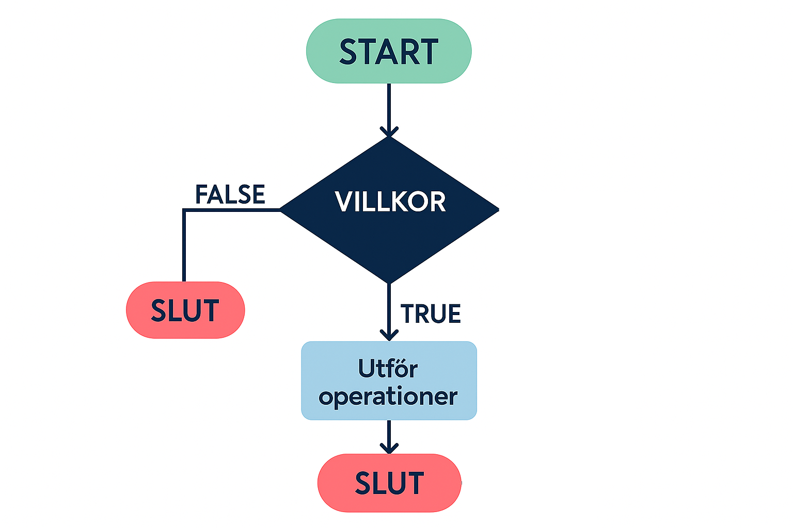

# Selektion
I Python är exempelvis `if`-satsen en så kallad _villkorssats_. Med detta menas att vi placerar ett villkor på en eller flera rader kod och deklarerar att denna kod enbart ska kompileras OM ett specifikt villkor uppfylls.

Vi tillämpar således selektion för att styra logiken i ett program genom att skapa "vägval", exempelvis genom att påstå att vi enbart vill dirigera en medlem på en webbplats till medlemssidan _OM_ det angivna användarnamnet faktiskt finns i vår databas.

Selektion, eller villkorssatser, är fundamentala i programmering eftersom de möjliggör att olika kodblock körs beroende på specifika villkor. Detta koncept gör att program kan fatta beslut baserat på data, användarinteraktioner eller andra villkor som uppstår under körningen. Ett "vägval" kan således tänkas illustreras på följande vis:

{: .styled-image }

Där _VILLKOR_ avser ett påstående som kan evalueras till `True` eller `False` 

## Implikationer av Selektion i Programflödet

* Dynamiskt Beteende
Selektion gör program dynamiska genom att tillåta dem att agera olika under olika omständigheter. Detta betyder att samma program kan utföra olika uppgifter och ge olika resultat baserat på de data det behandlar eller de villkor som uppfylls vid körningstillfället.

* Användarinteraktion
I applikationer där användarinteraktion är central, såsom webbapplikationer eller mobilappar, styr selektion hur programmet svarar på användarens handlingar. Till exempel kan en if-sats avgöra vad som händer när en användare klickar på en knapp eller fyller i ett formulär.

* Felhantering
Selektion är avgörande för effektiv felhantering i program. Genom att använda villkorliga uttalanden kan program känna igen potentiella fel, ogiltig data eller undantagstillstånd och hantera dem på ett lämpligt sätt, antingen genom att visa felmeddelanden, be om ny inmatning eller avbryta operationer.

* Optimering av programlogik
Selektion kan användas för att optimera program genom att se till att endast nödvändig kod körs. Genom att selektivt utföra vissa kodblock baserat på relevanta villkor, kan man minska onödig beräkning och resursanvändning.

* Sekvenskontroll
I komplexa programflöden, där flera steg eller operationer måste utföras i en specifik ordning, styr selektion vilka delar av programmet som ska köras och när. Detta är särskilt viktigt i scenarier som dataanalysprocesser, spellogik och arbetsflöden inom programvara.

# Sammanfattning av selektion
Selektion är en kärnfunktion i programmering som ger program förmågan att fatta beslut baserat på villkor. Genom att använda t.ex. `if`, `elif` och `else`-satser kan utvecklare kontrollera programflödet och säkerställa att rätt kodblock körs under rätt omständigheter. Att kombinera dessa satser med logiska operatorer och implementera nästlade `if`-satser öppnar upp för ännu större flexibilitet och kontroll. Genom att förstå och effektivt använda selektion kan utvecklare skapa program som är anpassningsbara, dynamiska och kan hantera en mängd olika situationer och data.