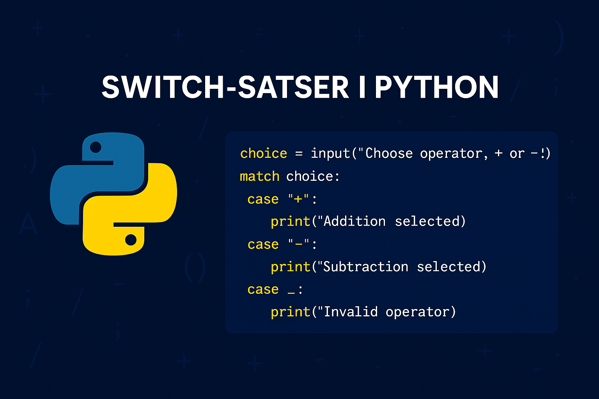

# `switch`-satsen
I Python är en `switch`-sats en annan typ av _villkorssats_. Dessa fungerar på så vis att vi tar emot ett input-värde och utvärderar vilket "fall" som matchar denna input. Där vi har en matchning kan vi sedan lägga till relevant kod som ska utföras, likt hur `if`-satser och deras villkor fungerar.

Även `switch`-satser nyttjas därför för att styra logiken i ett program genom att skapa vägval.

{: .styled-image }

## `switch`-satser i Python 
`switch`-satser introducerades i Python 10.0 och används genom nyckelorden `match` resp. `case` för att matcha ett värde mot eller flera "fall", vilka i sin tur agerar olika "vägar" i programmet. Om input exempelvis är `Addition` så kan vi etablera ett "fall" för `Addition` där vi sedan kan utföra addition mellan två heltal. Nästa gång applikationen körs så kanske input istället är `Subtraktion` och då utför vi istället subtraktion, osv.

Ponera exempelvis att vi har skrivit en miniräknare och vi vill att användaren inledningsvis ska få välja vilken operation som ska genomföras:
```python
choice = input("Choose operation (Addition or Subtraction): ")
number1 = int(input("Enter the first value: "))
number2 = int(input("Enter the second value: "))

match choice:
  case "Addition":
    print(number1 + number2)
  case "Subtraction":
    print(number1 - number2)
  case _:
    print("You must choose between 'Addition' and 'Subtraction'. Try again!")
```
<div class="code-example" markdown="1">
<pre><code># If choice is Addition, number1 is 10 and number2 is 5:
15

# If choice is Subtraction, number1 is 5 and number2 is 10:
-5</code></pre>
</div>

{: .highlight }
`case _:` avser ett "default" fall, d.v.s. vad som ska ske i de fall det inte finns något matchande case. Det fungerar med andra ord på samma sätt som en `else`-sats i den bemärkelsen. Notera gärna även att `int()` behövs för att konvertera värdena vi läser in från användaren till heltal, annars kommer vi inte att kunna utföra någon matematisk operation.

Vi hade givetvis kunnat uppnå samma struktur genom att arbeta med `if`-satser, t.ex. enligt:
```python
choice = input("Choose operation (Addition or Subtraction): ")
number1 = int(input("Enter the first value: "))
number2 = int(input("Enter the second value: "))

if choice == "Addition":
    print(number1 + number2)
elif choice == "Subtraction":
    print(number1 - number2)
else:
    print("You must choose between 'Addition' and 'Subtraction'. Try again!")
```

Så när vill man nyttja den ena syntaxen över den andra? Svaret är att det i de allra flesta fall inte spelar någon roll, d.v.s. att det är personlig preferens som får styra. Det finns vissa argument för att en `switch`-sats är snabbare än multipla `if`-satser, men skillnaden är oftast minimal. En generell utgångspunkt kan dock tänkas vara att nyttja en `switch`-sats i de fall vi behöver utvärdera fler än 5 påståenden då läsbarheten i koden argumenterbart är högre.

## Matcha flera värden samtidigt
Pythons `match`-sats erbjuder en kraftfull mekanism för att hantera situationer där du vill att ett kodblock ska exekveras för flera olika inmatningsvärden för samma `case`. Detta uppnås genom att använda vertikalstreck (`|`) för att separera värdena i ett `case`-block, vilket indikerar att kodblocket ska exekveras om inmatningen matchar något av de angivna värdena. Denna funktion är särskilt användbar för att kondensera kod och undvika upprepning när flera inmatningar leder till samma resultat.
```python
choice = input("Choose operation (Add, Subtract, Multiply, Divide): ")

match choice:
    case "Add" | "addition" | "+":
        print("Addition operation selected.")
    case "Subtract" | "subtraction" | "-":
        print("Subtraction operation selected.")
    case "Multiply" | "multiplication" | "*":
        print("Multiplication operation selected.")
    case "Divide" | "division" | "/":
        print("Division operation selected.")
    case _:
        print("Invalid operation selected.")
```
<div class="code-example" markdown="1">
<pre><code>#If choice is Add
Addition operation selected.

#If choice is +
Addition operation selected.

#If choice is division
Division operation selected.

#If choice is ++
Invalid operation selected.</code></pre>
</div>

Genom att matcha flera möjliga värden för varje operation blir koden - i detta fall - mer flexibel och tillgänglig för användaren. 

## Matcha med mönster
`match`-satsen stödjer även mer avancerad mönstermatchning, där du kan dekonstruera och matcha komplexa datatyper som listor, tupler och dictionaries (vilka alla är exempel på _kollektioner_, som kommer att introduceras i framtida avsnitt). Detta är en kraftfull funktion som kan användas för att skriva mer uttrycksfull och kondenserad kod, särskilt när du arbetar med datatyper som innehåller flera element.
```python
point = (2, 8)

match point:
    case (0, 0):
        print("Origo")
    case (x, 0):
        print(f"The point is on the X-axle at {x}")
    case (0, y):
        print(f"The point is on the Y-axle at {y}")
    case (x, y):
        print(f"The point is at ({x}, {y})")
```
<div class="code-example" markdown="1">
<pre><code>The point is at (2, 8)</code></pre>
</div>

I detta exempel representerar `point` en punkt i ett tvådimensionellt koordinatsystem som en _tupel_ av två värden. `match`-satsen används för att bestämma punktens position: om den ligger på origo, på X-axeln, Y-axeln, eller någon annanstans i koordinatsystemet. Mönstermatchningen låter oss enkelt dekonstruera tupeln `point` direkt i `case`-satserna för att få tillgång till dess komponenter (`x` och `y`), vilket gör koden lättläst och effektiv.

Om `point` istället hade haft värdena `(0, 3)` så hade vi fått utskriften `The point is on the Y-axle at 3` osv.

{: .highlight }
Vi anger inte ett "default" fall i detta kodexempel. Detta är tillåts i Python och kan tänkas vara relevant i kontexter där vi på förhand kan avgöra alla möjliga utfall. I detta scenario kan exempelvis en punkt i ett tvådimensionellt koordinatsystem enbart förhålla sig till de fall vi etablerat. I tidigare kodexempel har vi istället försökt matcha baserat på användarens input, vilket kan tänkas vara allt möjligt. Praxis kan dock tänkas vara att alltid nyttja `case _:`.

# Sammanfattning
`switch`-satser, introducerade i Python 10.0 genom `match`- och `case`- nyckelorden, erbjuder en mer strömlinjeformad och lättläst syntax för att hantera flervägs beslutsfattande jämfört med traditionella `if-elif`-kedjor. 

Genom att matcha ett inmatningsvärde mot fördefinierade "fall" kan `match`-satsen leda programflödet på ett sätt som är enkelt att följa och underhålla. Dessutom möjliggör Python's `match`-sats avancerad mönstermatchning, vilket utökar dess användbarhet till mer komplexa scenarier än enkel värdejämförelse. 

Trots dess användbarhet är valet mellan `match` och flera `if`-satser ofta en fråga om personlig preferens och specifika fall, men `match` kan erbjuda en klar fördel i situationer som kräver hög läsbarhet och komplex mönstermatchning.