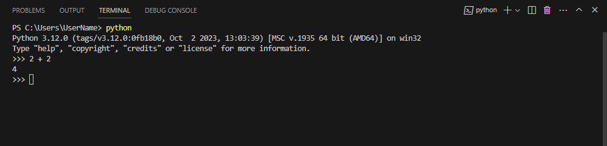

# "Påståenden" (statements)
Ett påstående är en instruktion som vår kompilator kan utföra. Vi har redan sett exempel på tre sorters påståenden: `print()`, `type()` och tilldelning.

När du skriver ett påstående i din Python-fil och sedan kör koden via terminalen (alt. kör kod direkt genom terminalen) så kommer Python att kompilera koden och visa eventuella resultat. Med eventuella resultat avses att exempelvis tilldelning i sig självt inte kommer att skriva ut något i terminalen, om inte variabeln efter tilldelningen skrivs ut med hjälp av `print()`.
```python
assignment = "A value"  # Nothing happens, in terms of output

print(assignment)       # The value of 'assignment' is printed
```
<div class="code-example" markdown="1">
<pre><code>A value</code></pre>
</div>

Ett Python-skript innehåller generellt sett en _sekvens av påståenden_. Om det finns mer än ett påstående (med tillhörande utskrift) så kommer resultaten att visas ett i taget allteftersom att resp. påstående kompileras/körs - vilket sker i en hierarkisk ordning (d.v.s. från påståendet på den första kodraden till påståendet på den sista kodraden).
```python
number = 10
print(number)
number = 20
number = 30
print(number)           # Will not print 20 since we've overwritten that value
```
<div class="code-example" markdown="1">
<pre><code>10
30</code></pre>
</div>

# "Uttryck" (expressions)
Ett uttryck är en kombination av värden, variabler och operatorer. Om du skriver ett uttryck, exempelvis `2 + 2`, så kommer kompilatorn att tolka och visa resultatet:
```python
>>> 2 + 2
```
<div class="code-example" markdown="1">
<pre><code>4</code></pre>
</div>

{: .highlight }
Du kan skriva Python-kod direkt i terminalen med kommandot `python`, vilket kan tänkas vara relevant i de fall man snabbt vill testa sig på behandling av variabler eller dylikt. Du kommer då att bemötas av gränssnittet som presenteras nedan där du kan skriva kod efter `>>>` som sedan utförs när du trycker på Enter-tangenten.

{: .styled-image }

Ett uttryck som sådant måste dock inte innehålla värden, variabler såväl som operatorer för att klassas som ett uttryck. Ett värde eller en variabel i sig kan exempelvis evalueras som ett uttryck:
```python
>>> 10
>>> number = 5
>>> number
```
<div class="code-example" markdown="1">
<pre><code>10
5</code></pre>
</div>

Att utvärdera ett uttryck är dock inte riktigt samma sak som att skriva ut ett värde, likt hur vi gjort tidigare med funktionen `print()`.
```python
>>> hello = "Hello, world!"
>>> hello
>>> print(hello)
```
<div class="code-example" markdown="1">
<pre><code>'Hello world!'
Hello world!</code></pre>
</div>

{: .highlight }
Notera att utskriften ser annorlunda ut i föregående exempel. Detta beror på att när vi enbart anger variabeln så kommer vi att skriva ut värdet representerat som den datatyp det lagrats som i variabeln samtidigt som vi med `print()` istället enbart skriver ut det faktiska värdet. 

I ett Python-script så kan alla uttryck vara tillåtna sådana (d.v.s. att inga fel genereras), men det betyder inte nödvändigtvis att det resulterar i något som är synligt för en användare. Exempelvis skulle vi kunna skriva något i stil med:
```python
test_1 = "msg"
test_2 = 22
test_3 = 4 + 5
```
Men då vi aldrig gör något med de variabler vi skapat så kommer inget att skrivas ut. 

# Sammanfattning
Förståelsen för påståenden och uttryck är fundamentala för alla som lär sig programmera, eftersom de ligger till grund för hur vi interagerar med och manipulerar data i våra program. Dessa koncept är inte bara viktiga för att skriva effektiv kod, utan också för att förstå hur kod exekveras och vilket resultat det ger.