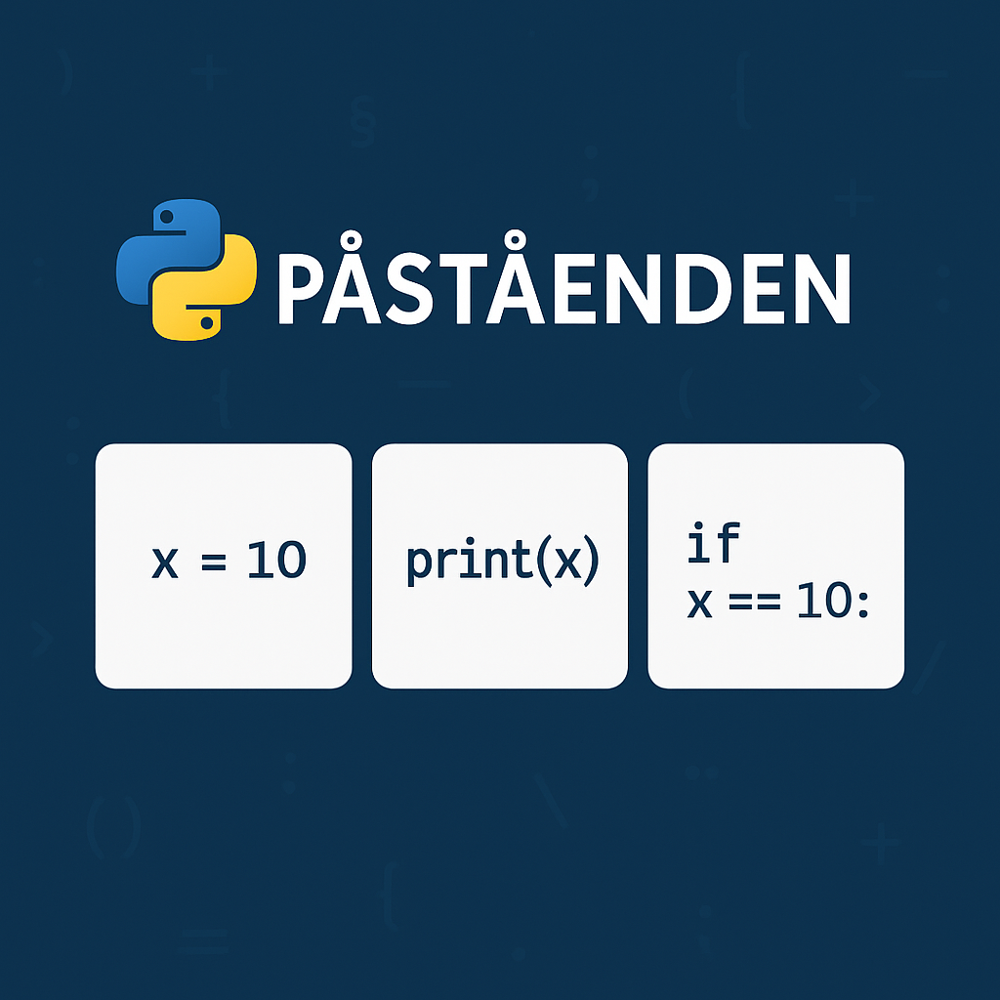
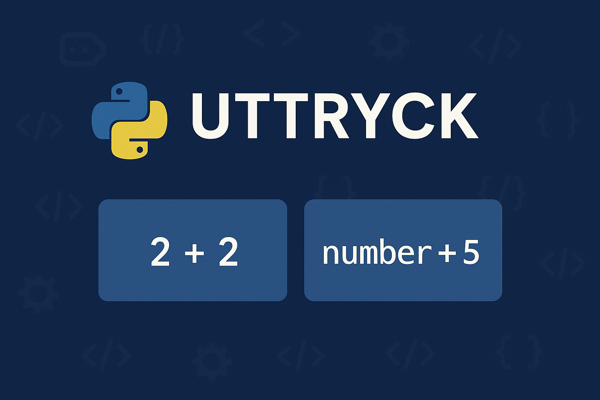

# "Påståenden" (statements)
Ett påstående (statement) är en fullständig instruktion som utför någon form av åtgärd, uppdaterar eller producerar en "effekt". Detta kan inkludera tilldelning till variabler, vissa funktionsanrop, villkorssatser och dylikt. Varje enskilt påstående avslutas med en ny rad eller ett semikolon. Vi har redan sett exempel på tre sorters påståenden i tidigare kapitel i nyttjandet av `print()` och tilldelning.
```python
# Assignment of a value to a variable
assignment = "A value"      

# Call to the print function to show the value of 'assignment'
print(assignment)           

# Conditional statement to check if the value of 'assignment' is "A value"
if assignment == "A value": 
    print("This is true") 
```
<div class="code-example" markdown="1">
<pre><code>A value
This is true</code></pre>
</div>

{: .styled-image }

När du skriver ett påstående i din Python-fil och sedan kör koden via Visual Studio Code (alt. kör koden direkt genom terminalen) så kommer Python att kompilera koden och visa eventuella resultat. Vi skriver "eventuella resultat" då exempelvis tilldelning i sig självt inte kommer att generera någon output, om inte variabeln efter tilldelningen skrivs ut med hjälp av  t.ex. `print()`-funktionen.
```python
assignment = "A value"  # Nothing happens, in terms of output

print(assignment)       # The value of 'assignment' is printed
```
<div class="code-example" markdown="1">
<pre><code>A value</code></pre>
</div>

Ett Python-skript innehåller generellt sett en _sekvens av påståenden_. Om det finns mer än ett påstående (med tillhörande utskrift) så kommer resultaten att visas ett i taget allteftersom att resp. påstående kompileras/körs - vilket alltid sker i en hierarkisk ordning (d.v.s. från påståendet på den första kodraden till påståendet på den sista kodraden).
```python
number = 10
print(number)
number = 20
number = 30
print(number)           # Will not print 20 since we've overwritten that value
```
<div class="code-example" markdown="1">
<pre><code>10
30</code></pre>
</div>

# "Uttryck" (expressions)
Ett uttryck är en kombination av värden, variabler, operatorer (exempelvis matematiska operatorer såsom `+`, `-`, etc.) och vissa funktionsanrop (de som resulterar i att något utvärderas) som kan __utvärderas__ till ett enskilt värde. Detta innebär att varje uttryck har ett värde, vilket skiljer det från ett påstående som inte nödvändigtvis måste generera ett värde. Om du exempelvis skriver uttrycket `2 + 2` så kommer kompilatorn att tolka och visa resultatet:
```python
>>> 2 + 2
```
<div class="code-example" markdown="1">
<pre><code>4</code></pre>
</div>

{: .styled-image }

Ett uttryck som sådant måste dock inte innehålla värden, variabler såväl som operatorer för att klassas som ett uttryck. Ett värde eller en variabel i sig kan exempelvis evalueras som ett uttryck:
```python
>>> 10
>>> number = 5
>>> number
```
<div class="code-example" markdown="1">
<pre><code>10
5</code></pre>
</div>

## Skillnaden mellan påståenden och uttryck
Ett enkelt sätt att skilja mellan ett påstående och ett uttryck är att ett uttryck kan visas eller _utvärderas till ett värde_, medan ett påstående _utför en handling_. I många fall är uttryck således en del av påståenden. Vid tilldelning är exempelvis det som finns på höger sida om tilldelningstecknet ett uttryck och hela raden istället utgör ett påstående.
```python
# The entire row is a statement, 10 is an expression
number = 10

# Using an expression within a print-statement is also possible
print(number + 5)
```
<div class="code-example" markdown="1">
<pre><code>15</code></pre>
</div>

Detta kan även förtydligas genom att särskilja utvärderingen av en variabel från utskriften av en varibel enligt:
```python
>>> hello = "Hello, world!"
>>> hello
>>> print(hello)
```
<div class="code-example" markdown="1">
<pre><code>'Hello world!'
Hello world!</code></pre>
</div>

Här ser utskriften annorlunda ut för de två olika tillvägagångssätten då när vi enbart anger variabeln så kommer värdet skrivas ut representerat som den datatyp det lagrats som i variabeln. `print()` kommer istället enbart att skriva ut det faktiska värdet.

### Funktionsanrop kan vara påståenden eller uttryck
Huruvida ett funktionsanrop är ett påstående eller ett uttryck beror generellt sett på kontexten av hur funktionen nyttjas. Exempelvis skulle funktionen `len()` (som returnerar längden på en kollektion) avse ett uttryck då längden utvärderas vid anropet. `print()` å andra sidan utför något, men utvärderar inget. Exempelvis skickas inte något värde tillbaka, något skrivs istället ut i terminalen.

# Sammanfattning
Förståelsen för påståenden och uttryck är fundamentala för alla som lär sig programmera, eftersom de ligger till grund för hur vi bygger upp och strukturerar vår kod. Korrekt användning av påståenden och uttryck är således avgörande för att skriva tydlig och effektiv kod. Denna distinktion hjälper också programmerare att förstå hur data manipuleras och hanteras genom programmets flöde.