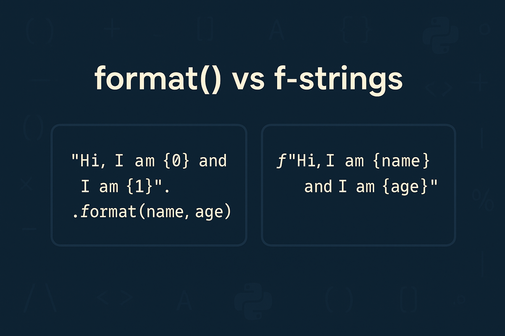

# Strängformatering
Vi har tidigare pratat om strängkomposition för att exempelvis formatera strängar, men det finns enklare sätt att inkludera uttryck eller variabler i strängar genom s.k. _strängformatering_. Exempelvis kan `f-strängar` nyttjas enligt:
```python
price = 20
print(f"The price for four cups of coffee is: {price*4} which, with the group discount, comes out to: {price*4 - ((price*4)/100)*15}")
```
<div class="code-example" markdown="1">
<pre><code>The price for four cups of coffee is: 80 which, with the group discount, comes out to: 68.0</code></pre>
</div>

{: .styled-image }

## `format()` vs `f-strings`
Formatering av strängar i Python kan göras på flera sätt, men två av de mest användbara och moderna metoderna är `str.format()` metoden och `f-strings` (formatsträngar).

### `format()` för formatering
Metoden `str.format()` låter dig infoga värden i en strängs platshållare. Platshållarna definieras med klammerparentes `{}` i strängen och värdena som ska sättas in anges som argument i `format()`-anropet. Detta gör det möjligt att skapa dynamiskt genererade strängar.
```python
name = "Erik"
age = 29
message = "Hi, my name is {0} and I am {1} years old.".format(name, age)
print(message)
```
<div class="code-example" markdown="1">
<pre><code>Hi, my name is Erik and I am 29 years old.</code> </pre>
</div>

Med `str.format()` kan du även namnge argumenten, vilket gör strängen lättare att läsa och underhålla.
```python
message = "Hi, my name is {name} and I am {age} years old.".format(name = "Erik", age = 29)
print(message)
```

### `f-strings` för formatering
`f-strings` erbjuder ett ännu mer lättläst och bekvämt sätt att infoga uttryck direkt inuti strängliteraler. En `f-string` skapas genom att sätta ett `f` framför strängen och sedan inkludera variabler eller uttryck direkt inom `{}` i strängen.
```python
name = "Erik"
age = 29
message = f"Hi, my name is {name} and I am {age} years old."
print(message)
```
<div class="code-example" markdown="1">
<pre><code>Hi, my name is Erik and I am 29 years old.</code> </pre>
</div>

`f-strings` stöder inte bara variabler utan också uttryck direkt inom `{}`. Detta gör dem extremt kraftfulla för strängformatering.
```python
name = "Erik"
age = 29
print(f"In five years, {name} will be {age + 5} years old.")
```
<div class="code-example" markdown="1">
<pre><code>In five years, Erik will be 34 years old.</code> </pre>
</div>

{: .styled-image }

## Flerradiga strängar
Flerradiga strängar i Python skapas med hjälp av tre dubbla citattecken (`"""`) eller tre enkla citattecken (`'''`). Detta gör det möjligt att skapa strängar som sträcker sig över flera rader, vilket är användbart för att bevara radbrytningar och annat vitt utrymme inom strängen. Dessa flerradiga strängar kan användas för att formatera text på ett mer överskådligt sätt eller inkludera långa textstycken direkt i en enda variabel.
```python
welcome_text = """Welcome to the game of GuessTheNumber!
Please select an option from the menu below to start the game.

The rules are simple; Guess which number between 1-100 has been selected by 
entering a number. 

You will get 3 chances in total.
"""
print(welcome_text)
```
<div class="code-example" markdown="1">
<pre><code>Welcome to the game of GuessTheNumber!
Please select an option from the menu below to start the game.

The rules are simple; Guess which number between 1-100 has been selected by
entering a number. 

You will get 3 chances in total.</code> </pre>
</div>

## Strängar och Unicode
I Python representeras strängar som _Unicode_, vilket är en internationell kodningsstandard som tillåter text och symboler från alla skriftsystem i världen att representeras och bearbetas enhetligt. Detta gör Python särskilt kraftfullt när det gäller att hantera internationella applikationer som behöver stödja flerspråkig text.

Unicode tillhandahåller en unik kodpunkt för varje tecken, oavsett plattform, program eller språk, vilket löser många av de begränsningar som fanns med äldre kodningssystem som ASCII. I Python 3 är strängar (str) kodade i Unicode som standard, vilket gör det enkelt att arbeta med text på ett globalt sätt.
```python
greeting = "Hej världen 🌍, こんにちは, 你好"
print(greeting)
```
<div class="code-example" markdown="1">
<pre><code>Hej världen 🌍, こんにちは, 你好</code></pre>
</div>

Denna universella hantering av text underlättar för utvecklare att skapa program som kan interagera med användare på deras eget språk och representera en rik uppsättning tecken och symboler utan bekymmer om inkonsekventa kodningssystem.

## Escape-sekvenser
_Escape-sekvenser_ i Python används för att representera speciella tecken i strängar, tecken som annars skulle vara svåra eller omöjliga att inkludera direkt. De mest vanliga escape-sekvenserna inkluderar:

* `\n` för nyrad, vilket skapar en ny rad i strängen.
* `\t` för tab, vilket lägger till en tabbavstånd i strängen.
* `\\` för att inkludera en bakåtstreck (`\`) i strängen, eftersom bakåtstreck används för escape-sekvenser.
* `\"` och \' för att inkludera dubbla (`"`) respektive enkla (`'`) citationstecken i en sträng, vilket är användbart när du vill inkludera dessa tecken i en sträng som är omsluten av samma tecken.

Escape-sekvenser gör det möjligt att infoga kontrolltecken och andra icke-skrivbara tecken i strängar, vilket är särskilt användbart för formatering och presentation av text.
```python
text = "This is the first row.\nThis is the second row with a \ttab."
print(text)
```
<div class="code-example" markdown="1">
<pre><code>This is the first row.
This is the second row with a   tab.</code></pre>
</div>

# Sammanfattning
I detta kapitel har vi diskuterat olika sätt att skapa och formatera strängar i Python, vilket är grundläggande för hantering och presentation av text. Vi har introducerat _f-strängar_ och metoden `str.format()` som kraftfulla och lättanvända verktyg för att inkludera uttryck och variabler direkt inom strängar. Dessutom har vi belyst vikten av Unicode för internationell textbearbetning och hur s.k. escape-sekvenser kan användas för att inkludera speciella tecken i strängar.

Genom att behärska dessa tekniker kan Python-utvecklare effektivt hantera textdata i sina program, vilket är ett kritiskt kompetensområde i många programmeringsprojekt.

# Relevanta länkar
* [Python Docs - f-strings](https://docs.python.org/3/reference/lexical_analysis.html#formatted-string-literals)
* [Python Docs - str.format](https://docs.python.org/3/library/stdtypes.html#str.format)
* [Python Docs - Unicode](https://docs.python.org/3/whatsnew/2.0.html#unicode)
* [Python Docs - Escape sequences](https://docs.python.org/3/reference/lexical_analysis.html#escape-sequences)