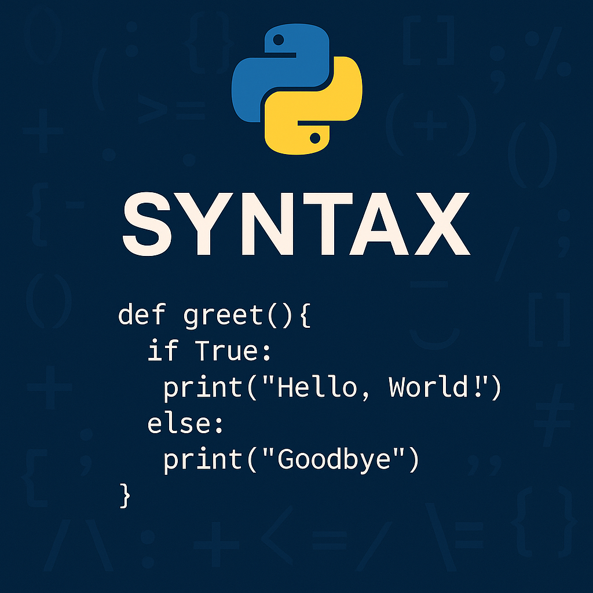

# Syntax
Nu när du har skapat samt ställt in din arbetsyta och skrivit ditt första program i Python är det dags att fördjupa dig i Python-syntaxens värld. Man kan likna en syntax med hur grammatiken fungerar i det svenska språket där man skriver på ett visst sätt för att andra ska förstå vad du menar.

Utöver syntaxen så finns det även vissa regler och mönster som styr hur ditt "språk" ser ut, vilka säkerställer att datorn kan tolka och förstå dina kommandon korrekt. För att dra paralleller till det svenska språket så kan detta t.e.x. tänkas vara att vi måste använda fullständiga meningar. 

I detta kapitel kommer vi att visa exempel på strukturen för språket Python samt några regler som vi behöver anpassa oss efter.

{: .styled-image }

## Att förstå Python-syntaxen

I syfte om att förstå syntaxen i Python, låt oss bryta ned och beskriva varje beståndsdel var för sig.

## Indentering
Indentering är kritiskt i Python och används för att definiera _kodblock_. Till skillnad från många andra programmeringsspråk som använder klammerparenteser `{}` för att markera början och slutet på ett kodblock, använder Python indentering för detta ändamål. 

Exempelvis påvisas korrekt indentering i bilden ovan, där respektive utskrift (`print("Hello, World!")` & `print("Goodbye")`) är placerade inom det kodblock som `if`- och `else`-satserna avser, vilka i sin tur är placerade inom det övergripande kodblocket som funktionen `greet()` avser.
```python
def greet():
    if True:
        print("Hello, World!")
    else:
        print("Goodbye")
```

Om vi däremot hade skrivit koden enligt nedan så hade vi stött på ett felmeddelande i form av ett `IndentationError`:
```python
def greet():
    if True:
    print("Hello, World!")
    else:
    print("Goodbye")
```

Funktioner, `if`- och `else`-satser är koncept vi kommer att arbeta med i framtida kapitel, men det är i detta fall indenteringen som är viktig att ta i beaktande. Exempelvis kommer vi att stöta på samma fel med nedan kodsnutt:

```python
print("This is correct indentation")
    print("This is incorrect indentation")
```
Utöver faktiska felmeddelanden i form av `IndentationError` så kan felaktig indentering även leda till oväntade beteenden i din kod. Exempelvis om du avsåg för en viss kodrad att tillhöra ett annat block än vad det gör.

## Kommentarer
Notera att `#`-symbolen indikerar startpunkten för en kommentar. En kommentar kan vara körbar kod, fritext eller principiellt vad du än kan tänkas vilja skriva. Kommentarer är något som kompilatorn kommer att ignorera när koden körs, d.v.s. att det enbart är till för dig och andra utvecklare - exempelvis för att tillhandahålla beskrivande text för den kod du skrivit.

Det är möjligt att skriva kommentarer över en eller flera rader där `#`-symbolen nyttjas för enradiga kommentarer och `'''` kan nyttjas för att skriva kommentarer över flera rader, t.ex. enligt: 
```python
print(type("Hello, world!"))
print(type(23))
'''
the first row will print <class 'int'> and
the second row will print <class 'str'>
'''
```

{: .highlight }
**TIPS:** I Visual Studio Code kan du markera den kod du vill kommentera och ange tangentbordskommandot `SHIFT + ALT + A` (i Windows OS) eller `SHIFT + OPTION(⌥) + A` (i Mac OS) för att kommentera ut det du markerat. För att sedan ta bort kommentaren så kan du markera koden på nytt och ange samma kommando. Detta underlättar mycket när man vill exkludera viss kod i testsyfte.

# Sammanfattning
I detta kapitel har vi utforskat de grundläggande syntaxelementen i Python, inklusive vikten av korrekt indentering samt hur man använder kommentarer för att öka kodens läsbarhet. Dessa koncept - tillsammans med värden, datatyper och variabler - är avgörande för att skriva korrekt och lättförståelig Python-kod. Att behärska dessa grundläggande principer kommer att lägga en stabil grund för vidare lärande och utforskning av Python.