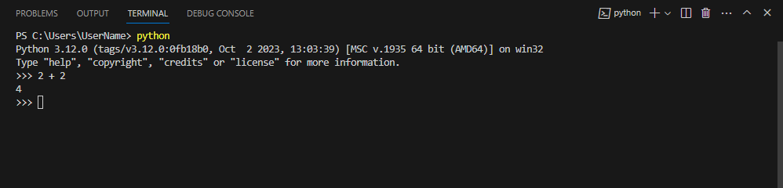

# Variabler
En av de mest kraftfulla funktionerna i ett programmeringsspråk är förmågan att manipulera _variabler_. En variabel är ett namn som refererar till ett värde.

Genom tilldelning så kan vi skapa variabler och tillhandahålla dem med värden: 
```python
message = "Hello, world!"
student_age = 22
pi = 3.14159
```

I ovan exempel så ser vi tre olika tilldelningar som resulterar i tre olika variabler. På den första raden så tilldelas variabeln `message` strängen `"Hello, world!"`, på den andra raden tilldelas variabeln `studentAge` heltalet `22` och på den tredje raden tilldelas variabeln `pi` flyttalet `3.14159`.

Notera att vi för `"Hello, world!"` använder dubbla situationstecken för att omsluta strängen. Generellt sett har `'` och `"` samma funktion i Python, men om en sträng innehåller ett enda `'`-tecken (t.ex. meningen `it's all ogre`) så måste det omslutas av dubbla situationstecken (`"it's all ogre"`) för att tolkas som en sträng.

Tidigare så har vi angivit värdet som vi vill skriva ut direkt inom parenteserna för `print()`-funktionen (t.ex. `print(3.2)`), men det är även möjligt att ange representationen av ett värde - d.v.s. en variabel:  
```python
message = "Hello, world!"
student_age = 22
print(message)
print(student_age)
```
<div class="code-example" markdown="1">
<pre><code>Hello, world!
22</code></pre>
</div>

## Dynamiskt typat programmeringsspråk (Dynamically typed language)
Som nämnt i föregående kapitel så medför det faktum att Python är ett starkt och dynamiskt typat språk dels att vi måste vara säkra på vilken datatyp en variabel har som värde, d.v.s. att det exempelvis är skillnad på `"1"` och `1` vid utförandet av matematiska operationer. 

Python är dock dessutom ett _dynamiskt typat språk_ (dynamically typed language) vilket innebär att du **inte** specificerar datatypen för de variabler du skapar. Exempelvis kan vi lagra ett textvärde i variabeln `number1`, trots att namnet indikerar att det är ett heltal. 

Detta fungerar då Python alla datatyper som _objekt_, oavsett om det är enkel data såsom heltal och decimaltal eller mer komplexa typer såsom listor och klassinstanser. När du lagrar ett objekt i en variabel så etableras en _referens_ till objektet, inte det _faktiska objektet_. Det är denna mekanism som gör det möjligt att inte fastställa datatypen på förhand, då referensen alltid kan utvärderas i efterhand.

Fördelen med detta är att koden blir något mer abstrakt, lättare att förstå och argumenterbart enklare att skriva - med nackdelen att du själv behöver ha kontroll på vad för slags datatyp en variabel innehåller vid exekvering.

Exempelvis är det fullt möjligt att byta datatyp på samma variabel enligt:
```python
message = "Hello, world!"
print(message)
message = 22
print(message)
message = True
print(message)
```
<div class="code-example" markdown="1">
<pre><code>Hello, world!
22
True</code></pre>
</div>

## Variabelnamn och nyckelord
Utvecklare väljer generellt meningsfulla och representativa namn för sina variabler. Detta för att utvecklaren själv såväl som andra enkelt ska förstå vad det är som variabeln i fråga representerar. Om vi föreställer oss ett scenario där vi ämnar lagra en användares angivna lösenord så är det möjligt att lagra det i stil med:
```python
x = "xHyra6h%"
```

Men det kan snabbt bli svårt att särskilja en variabel från en annan samt snabbt bilda sig en uppfattning av koden och dess syfte första gången man ser den. Det skulle således vara betydligt tydligare vilket värde variabeln representerar om vi istället angav något i stil med:
```python
user_password = "xHyra6h%"
```

Variabelnamn som sådana kan vara godtyckligt långa och innehålla bokstäver såväl som siffror (de måste dock inledas med en bokstav). Det finns dock vissa konventioner för namngivning i Python och dessa talar för att vi exempelvis inte nyttjar versaler i variabelnamn, även om Python accepterar sådan namngivning. D.v.s. att `Student_Age` och `student_age` skulle vara två olika variabler.

Underscore (`_`) kan förekomma i variabelnamn då vi vill att variabelnamnet ska bestå av flera ord, t.ex. `user_password`, `user_name`, och dylikt.

Du behöver inte vara orolig över att ange otillåtna variabelnamn då du snabbt kommer att bemötas av ett syntaxfel i de fall du har otillåtna namn. Exempelvis enligt:
```python
>>> 123 = "test"
>>> a123 = "test"
>>> ab$ = "test"
>>> if = "test"
```
<div class="code-example" markdown="1">
<pre><code>SyntaxError: invalid syntax
SyntaxError: invalid syntax
SyntaxError: invalid syntax</code></pre>
</div>

{: .highlight }
Du kan skriva Python-kod direkt i terminalen med kommandot `python`, vilket kan tänkas vara relevant i de fall man snabbt vill testa sig på behandling av variabler eller dylikt. Du kommer då att bemötas av gränssnittet som presenteras i bilden nedan. I terminalen kan du sedan skriva din python kod efter `>>>` och som då utförs så fort du trycker på Enter-tangenten.

{: .styled-image }

Det bör även nämnas att när du skriver kod i en Python-fil inuti Visual Studio Code (d.v.s. istället för att köra koden direkt från `python`-kommandot i terminalen) så kommer du direkt att bemötas av ett felmeddelande. Koden kommer med andra ord inte ens att vara körbar utan du kommer istället att ges en varning från Visual Studio om dessa problem. 

{: .styled-image }

`123` är ett otillåtet namn då det inte inleds med en bokstav - därav att `a123` anses vara ett tillåtet namn. `ab$` är ett otillåtet namn då det innehåller specialtecknet `$`, men varför får vi ett syntaxfel i det sista fallet med `if`? Felet beror på att `if` råkar vara ett av de nyckelord som är integrerade i Python - d.v.s. att det är ord som redan uppfyller ett syfte genom att definiera språkets regler och struktur, vilket medför att de inte kan nyttjas som variabelnamn. Det skulle dock vara tillåtet om vi inte längre representerade nyckelordet genom att bygga vidare på variabelnamnet, t.ex. i stil med:
```python
if_old_age = "Sorry, you're too old to be eating of the children's menu"
```

# Sammanfattning
I detta kapitel har vi utforskat variabler och deras namngivningskonventioner. Vi har diskuterat implikationerna av att Python är ett _dynamiskt typat språk_ och hur det medför att vi bl.a. kan manipulera olika typer av värden genom tilldelning då vi inte måste explicita datatyper. Vi har även diskuterat vikten av att välja meningsfulla variabelnamn och hur Python använder kommentarer för att göra koden mer läsbar.

Genom att förstå dessa grundläggande byggstenar kan vi skriva klar och korrekt Python-kod som är lätt att läsa och underhålla. Det lägger också grunden för mer avancerade ämnen som funktioner, kontrollflöden och datastrukturer som vi kommer att utforska i senare kapitel.