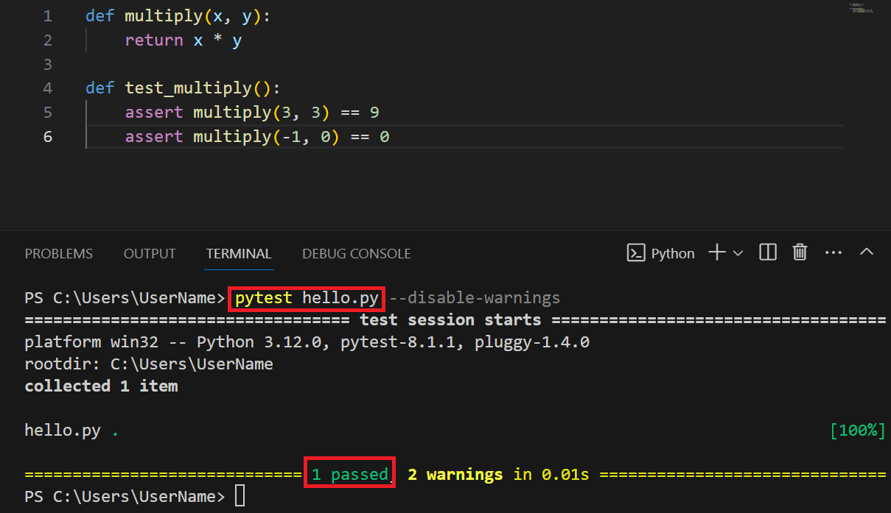
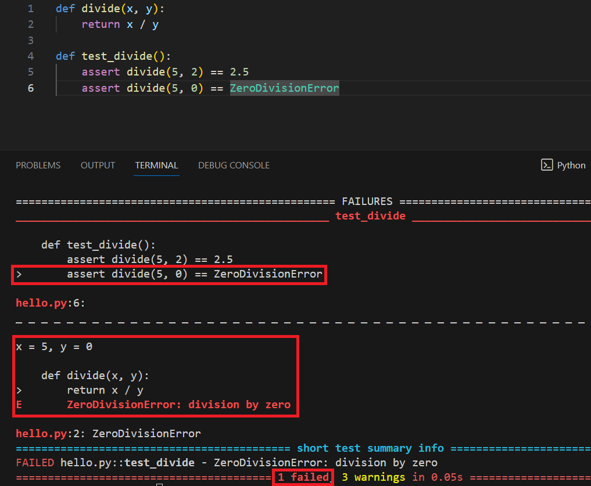

# Testning
Testning är en kritisk del av mjukvaruutvecklingen som säkerställer att din kod fungerar som avsett och hjälper till att upptäcka fel tidigt i utvecklingsprocessen. Python erbjuder inbyggda verktyg och bibliotek för att underlätta olika typer av testning, från enkla _enhetstester_ till mer komplexa _integrationstester_.

## Enhetstestning (unit testing)
Enhetstestning innebär att isolerade delar av programmet, såsom funktioner eller metoder, testas individuellt för att verifiera att de fungerar korrekt. Pythons standardbibliotek innehåller en modul som heter `unittest`, vilket är ett kraftfullt verktyg för att skapa och köra enhetstester.

För att skapa ett enhetstest, importera `unittest` och definiera en klass som ärver från `unittest.TestCase`. Inom denna klass, skapa metoder som börjar med nyckelordet `test` för att definiera specifika tester. Använd sedan `assert`-metoder, såsom `assertEqual` eller `assertTrue`, för att verifiera att koden uppfyller förväntningarna.
```python
# Import the unittest module
import unittest

# Define the function to test
def add(a, b):
    return a + b

''' Create a test class which inherits from unittest.TestCase
TestAddition is the name of the class, (unittest.TestCase) reflects the inheritance
'''
class TestAddition(unittest.TestCase):      
    # Define test methods, in this case we've defined two:
    def test_add_positive_numbers(self):
        ''' Each method uses self.assertEqual() to compare the result of the function with
        the expected result. If add(2, 3) returns 5, the test passes. Otherwise it fails.
        '''
        self.assertEqual(add(2, 3), 5)

    def test_add_negative_numbers(self):
        self.assertEqual(add(-1, -1), -2)

# Run tests if the script is run
if __name__ == '__main__':
    unittest.main()
```

{: .highlight }
Objektorienterade koncept såsom klasser, metoder och dylikt kommer att introduceras i framtida kapitel. Ovan exempel visar bara på hur `unittest` nyttjar objektorienterade koncept i testsyften.

### Enhetstester utan OOP
Även om Pythons `unittest`-ramverk ofta tillämpar objektorienterad programmering (OOP), kan du fortfarande skriva enkla tester utan att djupt dyka in i OOP-koncept. Du kan definiera funktioner som utför specifika tester och manuellt kalla på dem. Det är dock viktigt att notera att detta inte är den mest effektiva eller skalförmåga metoden för att hantera testning i större projekt.
```python
def test_addition():
    assert add(1, 2) == 3
    assert add(-1, -1) == -2

def add(a, b):
    return a + b

# Run the test-function
test_addition()
```

I exemplet ovan definierar vi en enkel funktion, `add`, och en testfunktion, `test_addition`, som använder `assert` för att kontrollera att funktionen fungerar korrekt. Denna metod kan användas för att snabbt testa små bitar av kod.

## `pytest`
`pytest` är ett annat populärt testramverk för Python som stödjer mer avancerade testscenarier och är känt för sin enkelhet. Till skillnad från `unittest` behöver du inte ärva från någon särskild klass eller strukturera dina tester som klasser och metoder; du definierar bara testfunktioner.

För att använda `pytest`, behöver du installera det med pip (genom att skriva `pip install pytest` i terminalen) och sedan skriva dina testfall som vanliga funktioner. `pytest` upptäcker automatiskt dessa tester om funktionernas namn börjar med test.
```python
def multiply(x, y):
    return x * y

def test_multiply():
    assert multiply(2, 3) == 6
    assert multiply(-1, 1) == -1
```

För att köra testerna med `pytest`, spara koden i en fil och kör `pytest filnamn.py` i din terminal. `pytest` kommer automatiskt att identifiera och köra alla funktioner som börjar med `test_`.

{: .styled-image }

Om vi skulle revidera vårt test så att vi istället undersöker om vår implementation av division tar 0 som nämnare i beaktande enligt:
```python
def divide(x, y):
    return x / y

def test_divide():
    assert divide(5, 2) == 2.5
    assert divide(5, 0) == ZeroDivisionError
```

Så kan vi testa att implementationen inte hanterar division med 0:
{: .styled-image }

## Testdriven utveckling (TDD)
Testdriven utveckling är en metodik där testfallen skapas innan själva koden skrivs. Detta uppmuntrar till en genomtänkt design och säkerställer att koden testas grundligt. Processen följer en cykel av att först skriva ett test som misslyckas, sedan skriva kod för att få testet att lyckas, och slutligen refaktorera koden (d.v.s. revidera koden) för att förbättra dess struktur och klarhet.

## Mocking
Ibland när du testar en del av din kod, vill du inte att vissa externa resurser eller komplexa system ska involveras i testet. I dessa fall kan du använda "mocking" för att ersätta dessa beroenden med enklare, kontrollerbara versioner. Pythons `unittest`-modul erbjuder en `mock`-del för detta ändamål.
```python
from unittest.mock import MagicMock
import unittest

class MyTest(unittest.TestCase):
    def test_function_with_external_call(self):
        # Create a mock instance in external_system
        external_system = MagicMock()
        # Configure the mock to return 'mocked value' when 'some_method' is called
        external_system.some_method.return_value = 'mocked value'

        ''' Here, you would call your function that uses external_system but instead
        we use external_system.some_method() directly for demonstrative purposes
        '''
        result = external_system.some_method()

        # Tests that the result of some_method is as expected
        self.assertEqual(result, 'mocked value')

if __name__ == '__main__':
    unittest.main()
```

## Integrationstester
Integrationstester är utformade för att testa interaktioner mellan olika delar av ett program, såsom funktioner, moduler eller externa system. Medan enhetstester fokuserar på individuella komponenter isolerat, säkerställer integrationstester att dessa komponenter fungerar väl tillsammans när de kombineras.

Integrationstester kan variera i omfattning från att testa interaktioner mellan två funktioner inom samma program till att testa hur programmet interagerar med externa system som databaser, webbtjänster eller andra applikationer.

Låt oss säga att vi har två funktioner i vårt program: `fetchData()` som hämtar data från en databas, och `processData(data)` som bearbetar denna data. Ett integrationstest skulle då kunna se ut så här:
```python
import unittest

class TestDatabaseIntegration(unittest.TestCase):
    def test_datamanagement(self):
        # Assume `fetchData` fetches data from the database
        raw_data = fetchData()
        # Now verify that `fetchData` actually fetches data using `assertNotEqual()`
        self.assertNotEqual(raw_data, None)

        # Assume `processData` does some form of processing on the data
        processed_data = processData(raw_data)
        # Verify that the processing generates the expected result
        self.assertEqual(processed_data, expected_output)
```

I exemplet ovan testar vi _integrationen_ mellan `fetchData()` och `processData()` genom att först verifiera att vi får tillbaka data från databasen och sedan säkerställa att bearbetningen av denna data ger det förväntade resultatet.

{: .highlight }
`expected_output` skulle behöva definieras beroende på kontexten, exempelvis kanske den förväntade datan är alla kunder i alfabetisk ordning, alla ordrar lagda i december eller dylikt.

# Sammanfattning
Testning är en väsentlig del av att skriva pålitlig och robust kod. Pythons rika ekosystem av testverktyg, som unittest och pytest, erbjuder flexibla lösningar för att täcka dina testbehov. Genom att börja med enkla enhetstester och sedan utforska mer avancerade tekniker som TDD och mocking, kan utvecklare skapa mer robusta applikationer. Att integrera testning som en naturlig del av utvecklingsprocessen främjar goda programmeringsvanor och bidrar till högre kodkvalitet.

Genom att anta testdriven utveckling och effektivt använda verktyg som mocking, kan du bygga applikationer med högre kvalitet och minska risken för fel i produktion. Att bemästra testtekniker är därför avgörande för varje Python-utvecklare som strävar efter att skapa välutformad och hållbar kod.